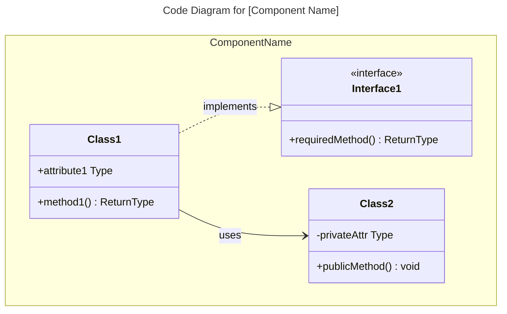
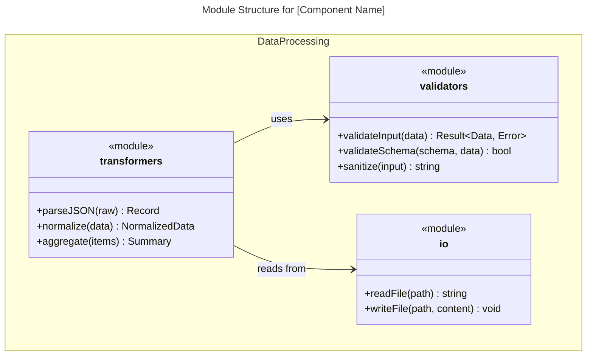
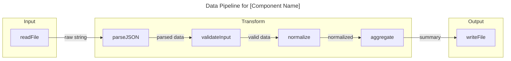
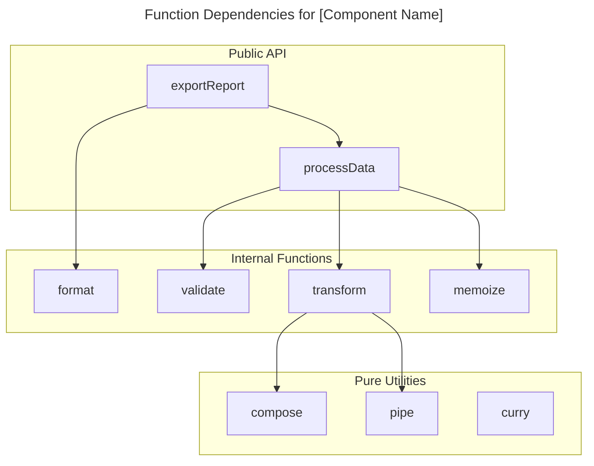

# C4 Code Level: [Directory Name]

## Overview

This public intake copy packages `plugins/antigravity-awesome-skills-claude/skills/c4-code` from `https://github.com/sickn33/antigravity-awesome-skills` into the native Omni Skills editorial shape without hiding its origin.

Use it when the operator needs the upstream workflow, support files, and repository context to stay intact while the public validator and private enhancer continue their normal downstream flow.

The packaged support pack adds a checklist, rubric, playbook, prompt template, router note, and source manifest so reviewers can audit the import as a complete workflow kit instead of a raw file dump.

# C4 Code Level: [Directory Name]

Imported source sections that did not map cleanly to the public headings are still preserved below or in the support files. Notable imported sections: Code Elements, Dependencies, Relationships, Notes, Key Distinctions, Limitations.

## When to Use This Skill

Use this section as the trigger filter. It should make the activation boundary explicit before the operator loads files, runs commands, or opens a pull request.

- Working on c4 code level: [directory name] tasks or workflows
- Needing guidance, best practices, or checklists for c4 code level: [directory name]
- The task is unrelated to c4 code level: [directory name]
- You need a different domain or tool outside this scope
- Use when the request clearly matches the imported source intent: Expert C4 Code-level documentation specialist. Analyzes code directories to create comprehensive C4 code-level documentation including function signatures, arguments, dependencies, and code structure.
- Use when the operator should preserve upstream workflow detail instead of rewriting the process from scratch.

## Operating Table

| Situation | Start here | Why it matters |
| --- | --- | --- |
| First-time use | `references/omni-import-playbook.md` | Establishes the workflow, review packet, and provenance expectations before work begins |
| PR review or merge readiness | `references/omni-import-rubric.md` | Turns the imported skill into a checklist-driven review packet instead of an opaque file copy |
| Source or lineage verification | `scripts/omni_import_print_origin.py` | Confirms repository, branch, commit, and imported path quickly |
| Workflow execution | `references/omni-import-checklist.md` | Gives the operator the smallest useful entry point into the support pack |
| Handoff decision | `agents/omni-import-router.md` | Helps the operator switch to a stronger native skill when the task drifts |

## Workflow

This workflow is intentionally editorial and operational at the same time. It keeps the imported source useful to the operator while still satisfying the public intake standards that feed the downstream enhancer flow.

1. Clarify goals, constraints, and required inputs.
2. Apply relevant best practices and validate outcomes.
3. Provide actionable steps and verification.
4. If detailed examples are required, open resources/implementation-playbook.md.
5. Confirm the user goal, the scope of the imported workflow, and whether this skill is still the right router for the task.
6. Read the overview, playbook, and source summary before loading any upstream support files.
7. Load only the references, examples, prompts, or scripts that materially change the outcome for the current request.

### Imported Workflow Notes

#### Imported: Instructions

- Clarify goals, constraints, and required inputs.
- Apply relevant best practices and validate outcomes.
- Provide actionable steps and verification.
- If detailed examples are required, open `resources/implementation-playbook.md`.

#### Imported: Overview

- **Name**: [Descriptive name for this code directory]
- **Description**: [Short description of what this code does]
- **Location**: [Link to actual directory path]
- **Language**: [Primary programming language(s)]
- **Purpose**: [What this code accomplishes]

#### Imported: Code Elements

### Functions/Methods

- `functionName(param1: Type, param2: Type): ReturnType`
  - Description: [What this function does]
  - Location: [file path:line number]
  - Dependencies: [what this function depends on]

### Classes/Modules

- `ClassName`
  - Description: [What this class does]
  - Location: [file path]
  - Methods: [list of methods]
  - Dependencies: [what this class depends on]

## Examples

### Example 1: Ask for the upstream workflow directly

```text
Use @c4-code to handle <task>. Start with the workflow playbook, load only the upstream files that change the outcome, and keep provenance visible in the answer.
```

**Explanation:** This is the safest starting point when the operator needs the imported workflow, but not the entire repository.

### Example 2: Inspect origin and import state

```bash
python3 skills/c4-code/scripts/omni_import_print_origin.py
```

**Explanation:** Use this before review or troubleshooting when you need to confirm source repository, branch, commit, and path.

### Example 3: Review the support pack before execution

```bash
python3 skills/c4-code/scripts/omni_import_list_support_pack.py
```

**Explanation:** This gives the operator a quick inventory of the imported references, examples, scripts, router notes, and manifest files.

### Example 4: Build a reviewer packet

```text
Review @c4-code using the checklist, rubric, playbook, and source manifest, then summarize any gaps before merge.
```

**Explanation:** This is useful when the PR is waiting for human review and you want a repeatable audit packet.

### Imported Usage Notes

#### Imported: Example Interactions

### Object-Oriented Codebases
- "Analyze the src/api directory and create C4 Code-level documentation"
- "Document the service layer code with complete class hierarchies and dependencies"
- "Create C4 Code documentation showing interface implementations in the repository layer"

### Functional/Procedural Codebases
- "Document all functions in the authentication module with their signatures and data flow"
- "Create a data pipeline diagram for the ETL transformers in src/pipeline"
- "Analyze the utils directory and document all pure functions and their composition patterns"
- "Document the Rust modules in src/handlers showing function dependencies"
- "Create C4 Code documentation for the Elixir GenServer modules"

### Mixed Paradigm
- "Document the Go handlers package showing structs and their associated functions"
- "Analyze the TypeScript codebase that mixes classes with functional utilities"

#### Imported: Output Examples

When analyzing code, provide:
- Complete function/method signatures with all parameters and return types
- Clear descriptions of what each code element does
- Links to actual source code locations
- Complete dependency lists (internal and external)
- Structured documentation following C4 Code-level template
- Mermaid diagrams for complex code relationships when needed
- Consistent naming and formatting across all code documentation

```

## Best Practices

Treat the generated public skill as a reviewable packaging layer around the upstream repository. The checklist, rubric, worksheet, template, and playbook are there to make the import auditable, not to hide the source material.

- Keep the imported skill grounded in the upstream repository; do not invent steps that the source material cannot support.
- Prefer the smallest useful set of support files so the workflow stays auditable and fast to review.
- Keep provenance, source commit, and imported file paths visible in notes and PR descriptions.
- Use the checklist, rubric, worksheet, and playbook together instead of relying on a single section in isolation.
- Treat generated examples as scaffolding; adapt them to the concrete task before execution.
- Route to a stronger native skill when architecture, debugging, design, or security concerns become dominant.


## Troubleshooting

### Problem: The operator skipped the imported context and answered too generically

**Symptoms:** The result ignores the upstream workflow in `plugins/antigravity-awesome-skills-claude/skills/c4-code`, fails to mention provenance, or does not use the support pack at all.
**Solution:** Re-open the checklist, playbook, source summary, and source manifest. Load only the upstream files that materially change the answer, then restate the provenance before continuing.

### Problem: The imported workflow feels incomplete during review

**Symptoms:** Reviewers can see the generated `SKILL.md`, but they cannot quickly tell which references, examples, or scripts matter for the current task.
**Solution:** Use the operator packet and support-pack listing to point at the exact references, examples, scripts, and router notes that justify the path you took. If the gap is still real, record it in the PR instead of hiding it.

### Problem: The task drifted into a different specialization

**Symptoms:** The imported skill starts in the right place, but the work turns into debugging, architecture, design, security, or release orchestration that a native skill handles better.
**Solution:** Use the router note and related skills section to hand off deliberately. Keep the imported provenance visible so the next skill inherits the right context instead of starting blind.


## Related Skills

- `@00-andruia-consultant` - Use when the work is better handled by that native specialization after this imported skill establishes context.
- `@00-andruia-consultant-v2` - Use when the work is better handled by that native specialization after this imported skill establishes context.
- `@10-andruia-skill-smith` - Use when the work is better handled by that native specialization after this imported skill establishes context.
- `@10-andruia-skill-smith-v2` - Use when the work is better handled by that native specialization after this imported skill establishes context.

## Additional Resources

Use this support matrix and the linked files below as the operational packet for this imported skill. Together they provide the checklist, rubric, template, playbook, router guidance, and manifest that the validator expects to see represented in the public skill.

| Resource family | What it gives the reviewer | Example path |
| --- | --- | --- |
| `references` | checklists, rubrics, playbooks, and source summaries | `references/omni-import-checklist.md` |
| `examples` | prompt packets and usage templates | `examples/omni-import-operator-packet.md` |
| `scripts` | origin inspection and support-pack listing | `scripts/omni_import_list_support_pack.py` |
| `agents` | routing and handoff guidance | `agents/omni-import-router.md` |
| `assets` | machine-readable source manifest | `assets/omni-import-source-manifest.json` |

- [Imported intake checklist](references/omni-import-checklist.md)
- [Imported review rubric](references/omni-import-rubric.md)
- [Imported workflow playbook](references/omni-import-playbook.md)
- [Imported source summary](references/omni-import-source-summary.md)
- [Imported operator packet](examples/omni-import-operator-packet.md)
- [Imported prompt template](examples/omni-import-prompt-template.md)
- [Print origin details](scripts/omni_import_print_origin.py)
- [List support pack](scripts/omni_import_list_support_pack.py)

### Imported Reference Notes

#### Imported: Dependencies

### Internal Dependencies

- [List of internal code dependencies]

### External Dependencies

- [List of external libraries, frameworks, services]

#### Imported: Relationships

Optional Mermaid diagrams for complex code structures. Choose the diagram type based on the programming paradigm. Code diagrams show the **internal structure of a single component**.

### Object-Oriented Code (Classes, Interfaces)

Use `classDiagram` for OOP code with classes, interfaces, and inheritance:


````

### Functional/Procedural Code (Modules, Functions)

For functional or procedural code, you have two options:

**Option A: Module Structure Diagram** - Use `classDiagram` to show modules and their exported functions:



**Option B: Data Flow Diagram** - Use `flowchart` to show function pipelines and data transformations:



**Option C: Function Dependency Graph** - Use `flowchart` to show which functions call which:



### Choosing the Right Diagram

| Code Style                       | Primary Diagram                  | When to Use                                             |
| -------------------------------- | -------------------------------- | ------------------------------------------------------- |
| OOP (classes, interfaces)        | `classDiagram`                   | Show inheritance, composition, interface implementation |
| FP (pure functions, pipelines)   | `flowchart`                      | Show data transformations and function composition      |
| FP (modules with exports)        | `classDiagram` with `<<module>>` | Show module structure and dependencies                  |
| Procedural (structs + functions) | `classDiagram`                   | Show data structures and associated functions           |
| Mixed                            | Combination                      | Use multiple diagrams if needed                         |

**Note**: According to the [C4 model](https://c4model.com/diagrams), code diagrams are typically only created when needed for complex components. Most teams find system context and container diagrams sufficient. Choose the diagram type that best communicates the code structure regardless of paradigm.

#### Imported: Notes

[Any additional context or important information]

```

#### Imported: Key Distinctions

- **vs C4-Component agent**: Focuses on individual code elements; Component agent synthesizes multiple code files into components
- **vs C4-Container agent**: Documents code structure; Container agent maps components to deployment units
- **vs C4-Context agent**: Provides code-level detail; Context agent creates high-level system diagrams

#### Imported: Limitations

- Use this skill only when the task clearly matches the scope described above.
- Do not treat the output as a substitute for environment-specific validation, testing, or expert review.
- Stop and ask for clarification if required inputs, permissions, safety boundaries, or success criteria are missing.
