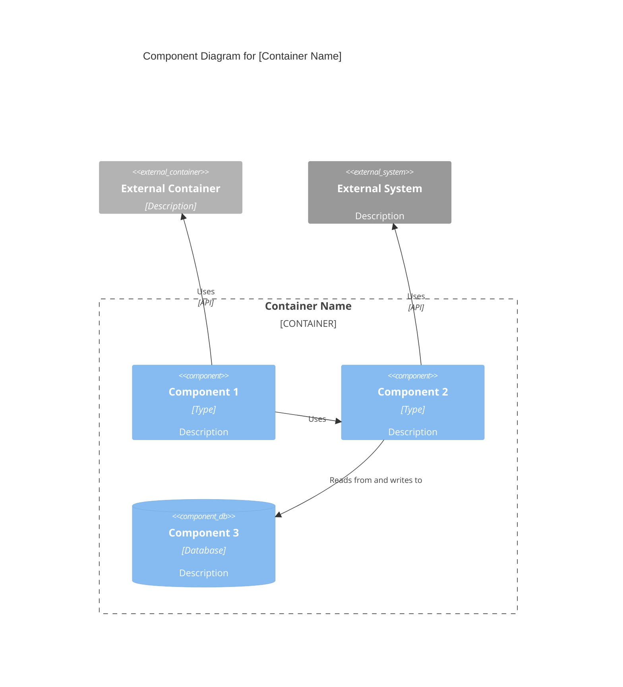

# C4 Component Level: [Component Name]

## Overview

This public intake copy packages `plugins/antigravity-awesome-skills/skills/c4-component` from `https://github.com/sickn33/antigravity-awesome-skills` into the native Omni Skills editorial shape without hiding its origin.

Use it when the operator needs the upstream workflow, support files, and repository context to stay intact while the public validator and private enhancer continue their normal downstream flow.

This intake keeps the copied upstream files intact and uses the `external_source` block in `metadata.json` plus `ORIGIN.md` as the provenance anchor for review.

# C4 Component Level: [Component Name]

Imported source sections that did not map cleanly to the public headings are still preserved below or in the support files. Notable imported sections: Purpose, Software Features, Code Elements, Interfaces, Dependencies, Component Diagram.

## When to Use This Skill

Use this section as the trigger filter. It should make the activation boundary explicit before the operator loads files, runs commands, or opens a pull request.

- Working on c4 component level: [component name] tasks or workflows
- Needing guidance, best practices, or checklists for c4 component level: [component name]
- The task is unrelated to c4 component level: [component name]
- You need a different domain or tool outside this scope
- Use when the request clearly matches the imported source intent: Expert C4 Component-level documentation specialist. Synthesizes C4 Code-level documentation into Component-level architecture, defining component boundaries, interfaces, and relationships.
- Use when the operator should preserve upstream workflow detail instead of rewriting the process from scratch.

## Operating Table

| Situation | Start here | Why it matters |
| --- | --- | --- |
| First-time use | `metadata.json` | Confirms repository, branch, commit, and imported path through the `external_source` block before touching the copied workflow |
| Provenance review | `ORIGIN.md` | Gives reviewers a plain-language audit trail for the imported source |
| Workflow execution | `SKILL.md` | Starts with the smallest copied file that materially changes execution |
| Supporting context | `SKILL.md` | Adds the next most relevant copied source file without loading the entire package |
| Handoff decision | `## Related Skills` | Helps the operator switch to a stronger native skill when the task drifts |

## Workflow

This workflow is intentionally editorial and operational at the same time. It keeps the imported source useful to the operator while still satisfying the public intake standards that feed the downstream enhancer flow.

1. Clarify goals, constraints, and required inputs.
2. Apply relevant best practices and validate outcomes.
3. Provide actionable steps and verification.
4. If detailed examples are required, open resources/implementation-playbook.md.
5. Confirm the user goal, the scope of the imported workflow, and whether this skill is still the right router for the task.
6. Read the overview and provenance files before loading any copied upstream support files.
7. Load only the references, examples, prompts, or scripts that materially change the outcome for the current request.

### Imported Workflow Notes

#### Imported: Instructions

- Clarify goals, constraints, and required inputs.
- Apply relevant best practices and validate outcomes.
- Provide actionable steps and verification.
- If detailed examples are required, open `resources/implementation-playbook.md`.

#### Imported: Overview

- **Name**: [Component name]
- **Description**: [Short description of component purpose]
- **Type**: [Component type: Application, Service, Library, etc.]
- **Technology**: [Primary technologies used]

#### Imported: Purpose

[Detailed description of what this component does and what problems it solves]

## Examples

### Example 1: Ask for the upstream workflow directly

```text
Use @c4-component-v2 to handle <task>. Start from the copied upstream workflow, load only the files that change the outcome, and keep provenance visible in the answer.
```

**Explanation:** This is the safest starting point when the operator needs the imported workflow, but not the entire repository.

### Example 2: Ask for a provenance-grounded review

```text
Review @c4-component-v2 against metadata.json and ORIGIN.md, then explain which copied upstream files you would load first and why.
```

**Explanation:** Use this before review or troubleshooting when you need a precise, auditable explanation of origin and file selection.

### Example 3: Narrow the copied support files before execution

```text
Use @c4-component-v2 for <task>. Load only the copied references, examples, or scripts that change the outcome, and name the files explicitly before proceeding.
```

**Explanation:** This keeps the skill aligned with progressive disclosure instead of loading the whole copied package by default.

### Example 4: Build a reviewer packet

```text
Review @c4-component-v2 using the copied upstream files plus provenance, then summarize any gaps before merge.
```

**Explanation:** This is useful when the PR is waiting for human review and you want a repeatable audit packet.

### Imported Usage Notes

#### Imported: Example Interactions

- "Synthesize all c4-code-\*.md files into logical components"
- "Define component boundaries for the authentication and authorization code"
- "Create component-level documentation for the API layer"
- "Identify component interfaces and create component diagrams"
- "Group database access code into components and document their relationships"

#### Imported: Output Examples

When synthesizing components, provide:

- Clear component boundaries with rationale
- Descriptive component names and purposes
- Comprehensive feature lists for each component
- Complete interface documentation with protocols and operations
- Links to all contained c4-code-\*.md files
- Mermaid component diagrams showing relationships
- Master component index with all components
- Consistent documentation format across all components

## Best Practices

Treat the generated public skill as a reviewable packaging layer around the upstream repository. The goal is to keep provenance explicit and load only the copied source material that materially improves execution.

- Keep the imported skill grounded in the upstream repository; do not invent steps that the source material cannot support.
- Prefer the smallest useful set of support files so the workflow stays auditable and fast to review.
- Keep provenance, source commit, and imported file paths visible in notes and PR descriptions.
- Point directly at the copied upstream files that justify the workflow instead of relying on generic review boilerplate.
- Treat generated examples as scaffolding; adapt them to the concrete task before execution.
- Route to a stronger native skill when architecture, debugging, design, or security concerns become dominant.


## Troubleshooting

### Problem: The operator skipped the imported context and answered too generically

**Symptoms:** The result ignores the upstream workflow in `plugins/antigravity-awesome-skills/skills/c4-component`, fails to mention provenance, or does not use any copied source files at all.
**Solution:** Re-open `metadata.json`, `ORIGIN.md`, and the most relevant copied upstream files. Check the `external_source` block first, then restate the provenance before continuing.

### Problem: The imported workflow feels incomplete during review

**Symptoms:** Reviewers can see the generated `SKILL.md`, but they cannot quickly tell which references, examples, or scripts matter for the current task.
**Solution:** Point at the exact copied references, examples, scripts, or assets that justify the path you took. If the gap is still real, record it in the PR instead of hiding it.

### Problem: The task drifted into a different specialization

**Symptoms:** The imported skill starts in the right place, but the work turns into debugging, architecture, design, security, or release orchestration that a native skill handles better.
**Solution:** Use the related skills section to hand off deliberately. Keep the imported provenance visible so the next skill inherits the right context instead of starting blind.


## Related Skills

- `@backend-dev-guidelines-v2` - Use when the work is better handled by that native specialization after this imported skill establishes context.
- `@backend-development-feature-development-v2` - Use when the work is better handled by that native specialization after this imported skill establishes context.
- `@backend-security-coder-v2` - Use when the work is better handled by that native specialization after this imported skill establishes context.
- `@backtesting-frameworks-v2` - Use when the work is better handled by that native specialization after this imported skill establishes context.

## Additional Resources

Use this support matrix and the linked files below as the operator packet for this imported skill. They should reflect real copied source material, not generic scaffolding.

| Resource family | What it gives the reviewer | Example path |
| --- | --- | --- |
| `references` | copied reference notes, guides, or background material from upstream | `references/n/a` |
| `examples` | worked examples or reusable prompts copied from upstream | `examples/n/a` |
| `scripts` | upstream helper scripts that change execution or validation | `scripts/n/a` |
| `agents` | routing or delegation notes that are genuinely part of the imported package | `agents/n/a` |
| `assets` | supporting assets or schemas copied from the source package | `assets/n/a` |


### Imported Reference Notes

#### Imported: Master Component Index Template

```markdown
# C4 Component Level: System Overview

#### Imported: Software Features

- [Feature 1]: [Description]
- [Feature 2]: [Description]
- [Feature 3]: [Description]

#### Imported: Code Elements

This component contains the following code-level elements:

- c4-code-file-1.md - [Description]
- c4-code-file-2.md - [Description]

#### Imported: Interfaces

### [Interface Name]

- **Protocol**: [REST/GraphQL/gRPC/Events/etc.]
- **Description**: [What this interface provides]
- **Operations**:
  - `operationName(params): ReturnType` - [Description]

#### Imported: Dependencies

### Components Used

- [Component Name]: [How it's used]

### External Systems

- [External System]: [How it's used]

#### Imported: Component Diagram

Use proper Mermaid C4Component syntax. Component diagrams show components **within a single container**:


````

**Key Principles** (from [c4model.com](https://c4model.com/diagrams/component)):

- Show components **within a single container** (zoom into one container)
- Focus on **logical components** and their responsibilities
- Show **component interfaces** (what they expose)
- Show how components **interact** with each other
- Include **external dependencies** (other containers, external systems)

````

#### Imported: System Components

### [Component 1]
- **Name**: [Component name]
- **Description**: [Short description]
- **Documentation**: c4-component-name-1.md

### [Component 2]
- **Name**: [Component name]
- **Description**: [Short description]
- **Documentation**: c4-component-name-2.md

#### Imported: Component Relationships

[Mermaid diagram showing all components and their relationships]
````

#### Imported: Key Distinctions

- **vs C4-Code agent**: Synthesizes multiple code files into components; Code agent documents individual code elements
- **vs C4-Container agent**: Focuses on logical grouping; Container agent maps components to deployment units
- **vs C4-Context agent**: Provides component-level detail; Context agent creates high-level system diagrams

#### Imported: Limitations

- Use this skill only when the task clearly matches the scope described above.
- Do not treat the output as a substitute for environment-specific validation, testing, or expert review.
- Stop and ask for clarification if required inputs, permissions, safety boundaries, or success criteria are missing.
