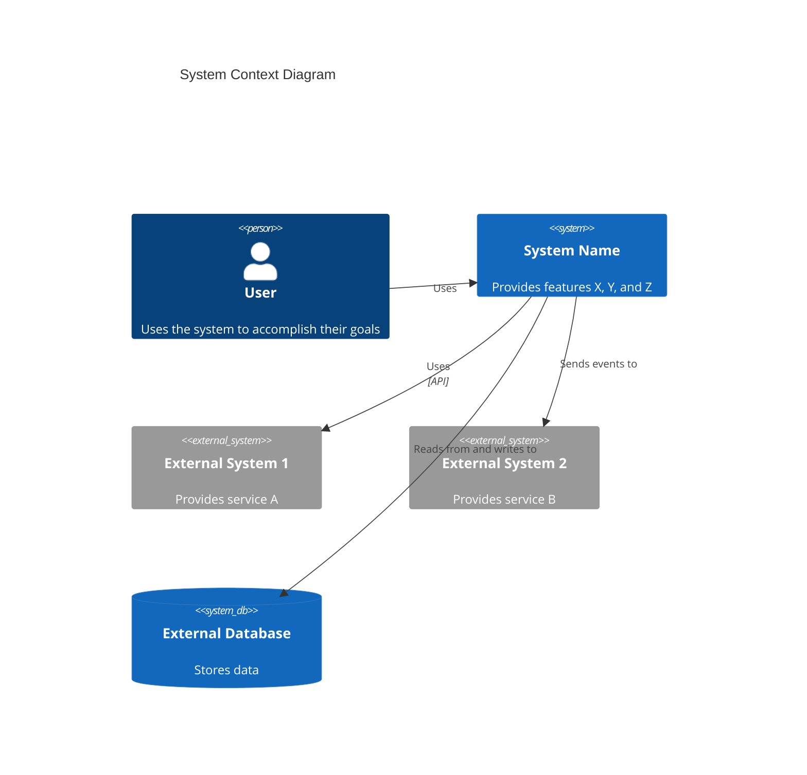

# C4 Context Level: System Context

## Overview

This public intake copy packages `plugins/antigravity-awesome-skills-claude/skills/c4-context` from `https://github.com/sickn33/antigravity-awesome-skills` into the native Omni Skills editorial shape without hiding its origin.

Use it when the operator needs the upstream workflow, support files, and repository context to stay intact while the public validator and private enhancer continue their normal downstream flow.

The packaged support pack adds a checklist, rubric, playbook, prompt template, router note, and source manifest so reviewers can audit the import as a complete workflow kit instead of a raw file dump.

# C4 Context Level: System Context

Imported source sections that did not map cleanly to the public headings are still preserved below or in the support files. Notable imported sections: System Overview, Personas, System Features, User Journeys, External Systems and Dependencies, System Context Diagram.

## When to Use This Skill

Use this section as the trigger filter. It should make the activation boundary explicit before the operator loads files, runs commands, or opens a pull request.

- Working on c4 context level: system context tasks or workflows
- Needing guidance, best practices, or checklists for c4 context level: system context
- The task is unrelated to c4 context level: system context
- You need a different domain or tool outside this scope
- Use when the request clearly matches the imported source intent: Expert C4 Context-level documentation specialist. Creates high-level system context diagrams, documents personas, user journeys, system features, and external dependencies.
- Use when the operator should preserve upstream workflow detail instead of rewriting the process from scratch.

## Operating Table

| Situation | Start here | Why it matters |
| --- | --- | --- |
| First-time use | `references/omni-import-playbook.md` | Establishes the workflow, review packet, and provenance expectations before work begins |
| PR review or merge readiness | `references/omni-import-rubric.md` | Turns the imported skill into a checklist-driven review packet instead of an opaque file copy |
| Source or lineage verification | `scripts/omni_import_print_origin.py` | Confirms repository, branch, commit, and imported path quickly |
| Workflow execution | `references/omni-import-checklist.md` | Gives the operator the smallest useful entry point into the support pack |
| Handoff decision | `agents/omni-import-router.md` | Helps the operator switch to a stronger native skill when the task drifts |

## Workflow

This workflow is intentionally editorial and operational at the same time. It keeps the imported source useful to the operator while still satisfying the public intake standards that feed the downstream enhancer flow.

1. Clarify goals, constraints, and required inputs.
2. Apply relevant best practices and validate outcomes.
3. Provide actionable steps and verification.
4. If detailed examples are required, open resources/implementation-playbook.md.
5. Confirm the user goal, the scope of the imported workflow, and whether this skill is still the right router for the task.
6. Read the overview, playbook, and source summary before loading any upstream support files.
7. Load only the references, examples, prompts, or scripts that materially change the outcome for the current request.

### Imported Workflow Notes

#### Imported: Instructions

- Clarify goals, constraints, and required inputs.
- Apply relevant best practices and validate outcomes.
- Provide actionable steps and verification.
- If detailed examples are required, open `resources/implementation-playbook.md`.

#### Imported: System Overview

### Short Description

[One-sentence description of what the system does]

### Long Description

[Detailed description of the system's purpose, capabilities, and the problems it solves]

## Examples

### Example 1: Ask for the upstream workflow directly

```text
Use @c4-context to handle <task>. Start with the workflow playbook, load only the upstream files that change the outcome, and keep provenance visible in the answer.
```

**Explanation:** This is the safest starting point when the operator needs the imported workflow, but not the entire repository.

### Example 2: Inspect origin and import state

```bash
python3 skills/c4-context/scripts/omni_import_print_origin.py
```

**Explanation:** Use this before review or troubleshooting when you need to confirm source repository, branch, commit, and path.

### Example 3: Review the support pack before execution

```bash
python3 skills/c4-context/scripts/omni_import_list_support_pack.py
```

**Explanation:** This gives the operator a quick inventory of the imported references, examples, scripts, router notes, and manifest files.

### Example 4: Build a reviewer packet

```text
Review @c4-context using the checklist, rubric, playbook, and source manifest, then summarize any gaps before merge.
```

**Explanation:** This is useful when the PR is waiting for human review and you want a repeatable audit packet.

### Imported Usage Notes

#### Imported: Example Interactions

- "Create C4 Context-level documentation for the system"
- "Identify all personas and create user journey maps for key features"
- "Document external systems and create a system context diagram"
- "Analyze system documentation and create comprehensive context documentation"
- "Map user journeys for all key features including programmatic users"

#### Imported: Output Examples

When creating context documentation, provide:

- Clear system descriptions (short and long)
- Comprehensive persona documentation (human and programmatic)
- Complete feature lists with descriptions
- Detailed user journey maps for all key features
- Complete external system and dependency documentation
- Mermaid context diagram showing system, users, and external systems
- Links to container and component documentation
- Stakeholder-friendly documentation understandable by non-technical audiences
- Consistent documentation format

## Best Practices

Treat the generated public skill as a reviewable packaging layer around the upstream repository. The checklist, rubric, worksheet, template, and playbook are there to make the import auditable, not to hide the source material.

- Keep the imported skill grounded in the upstream repository; do not invent steps that the source material cannot support.
- Prefer the smallest useful set of support files so the workflow stays auditable and fast to review.
- Keep provenance, source commit, and imported file paths visible in notes and PR descriptions.
- Use the checklist, rubric, worksheet, and playbook together instead of relying on a single section in isolation.
- Treat generated examples as scaffolding; adapt them to the concrete task before execution.
- Route to a stronger native skill when architecture, debugging, design, or security concerns become dominant.


## Troubleshooting

### Problem: The operator skipped the imported context and answered too generically

**Symptoms:** The result ignores the upstream workflow in `plugins/antigravity-awesome-skills-claude/skills/c4-context`, fails to mention provenance, or does not use the support pack at all.
**Solution:** Re-open the checklist, playbook, source summary, and source manifest. Load only the upstream files that materially change the answer, then restate the provenance before continuing.

### Problem: The imported workflow feels incomplete during review

**Symptoms:** Reviewers can see the generated `SKILL.md`, but they cannot quickly tell which references, examples, or scripts matter for the current task.
**Solution:** Use the operator packet and support-pack listing to point at the exact references, examples, scripts, and router notes that justify the path you took. If the gap is still real, record it in the PR instead of hiding it.

### Problem: The task drifted into a different specialization

**Symptoms:** The imported skill starts in the right place, but the work turns into debugging, architecture, design, security, or release orchestration that a native skill handles better.
**Solution:** Use the router note and related skills section to hand off deliberately. Keep the imported provenance visible so the next skill inherits the right context instead of starting blind.


## Related Skills

- `@00-andruia-consultant` - Use when the work is better handled by that native specialization after this imported skill establishes context.
- `@00-andruia-consultant-v2` - Use when the work is better handled by that native specialization after this imported skill establishes context.
- `@10-andruia-skill-smith` - Use when the work is better handled by that native specialization after this imported skill establishes context.
- `@10-andruia-skill-smith-v2` - Use when the work is better handled by that native specialization after this imported skill establishes context.

## Additional Resources

Use this support matrix and the linked files below as the operational packet for this imported skill. Together they provide the checklist, rubric, template, playbook, router guidance, and manifest that the validator expects to see represented in the public skill.

| Resource family | What it gives the reviewer | Example path |
| --- | --- | --- |
| `references` | checklists, rubrics, playbooks, and source summaries | `references/omni-import-checklist.md` |
| `examples` | prompt packets and usage templates | `examples/omni-import-operator-packet.md` |
| `scripts` | origin inspection and support-pack listing | `scripts/omni_import_list_support_pack.py` |
| `agents` | routing and handoff guidance | `agents/omni-import-router.md` |
| `assets` | machine-readable source manifest | `assets/omni-import-source-manifest.json` |

- [Imported intake checklist](references/omni-import-checklist.md)
- [Imported review rubric](references/omni-import-rubric.md)
- [Imported workflow playbook](references/omni-import-playbook.md)
- [Imported source summary](references/omni-import-source-summary.md)
- [Imported operator packet](examples/omni-import-operator-packet.md)
- [Imported prompt template](examples/omni-import-prompt-template.md)
- [Print origin details](scripts/omni_import_print_origin.py)
- [List support pack](scripts/omni_import_list_support_pack.py)

### Imported Reference Notes

#### Imported: Personas

### [Persona Name]

- **Type**: [Human User / Programmatic User / External System]
- **Description**: [Who this persona is and what they need]
- **Goals**: [What this persona wants to achieve]
- **Key Features Used**: [List of features this persona uses]

#### Imported: System Features

### [Feature Name]

- **Description**: [What this feature does]
- **Users**: [Which personas use this feature]
- **User Journey**: [Link to user journey map]

#### Imported: User Journeys

### [Feature Name] - [Persona Name] Journey

1. [Step 1]: [Description]
2. [Step 2]: [Description]
3. [Step 3]: [Description]
   ...

### [External System] Integration Journey

1. [Step 1]: [Description]
2. [Step 2]: [Description]
   ...

#### Imported: External Systems and Dependencies

### [External System Name]

- **Type**: [Database, API, Service, Message Queue, etc.]
- **Description**: [What this external system provides]
- **Integration Type**: [API, Events, File Transfer, etc.]
- **Purpose**: [Why the system depends on this]

#### Imported: System Context Diagram

[Mermaid diagram showing system, users, and external systems]

#### Imported: Context Diagram Template

According to the [C4 model](https://c4model.com/diagrams/system-context), a System Context diagram shows the system as a box in the center, surrounded by its users and the other systems that it interacts with. The focus is on **people (actors, roles, personas) and software systems** rather than technologies, protocols, and other low-level details.

Use proper Mermaid C4 syntax:



**Key Principles** (from [c4model.com](https://c4model.com/diagrams/system-context)):

- Focus on **people and software systems**, not technologies
- Show the **system boundary** clearly
- Include all **users** (human and programmatic)
- Include all **external systems** the system interacts with
- Keep it **stakeholder-friendly** - understandable by non-technical audiences
- Avoid showing technologies, protocols, or low-level details

#### Imported: Key Distinctions

- **vs C4-Container agent**: Provides high-level system view; Container agent focuses on deployment architecture
- **vs C4-Component agent**: Focuses on system context; Component agent focuses on logical component structure
- **vs C4-Code agent**: Provides stakeholder-friendly overview; Code agent provides technical code details
