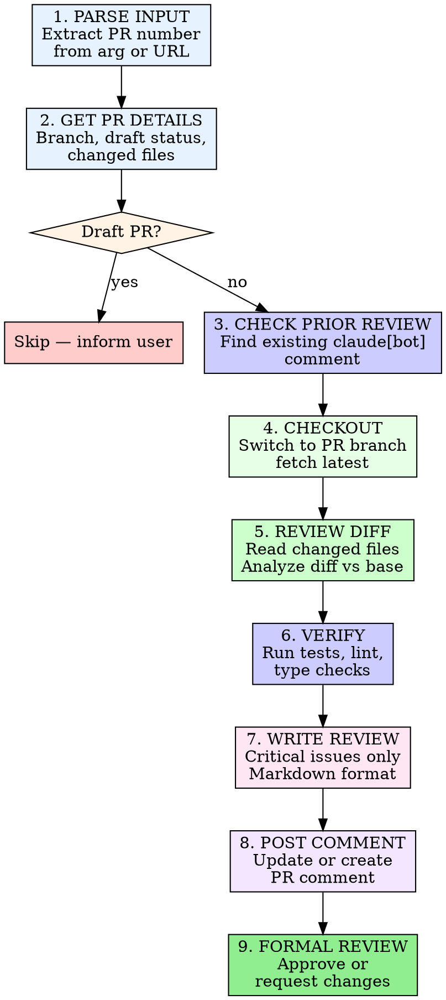

# Claude Code Review

## Overview

This public intake copy packages `.claude/skills/claude-code-review` from `https://github.com/DataRecce/recce.git` into the native Omni Skills editorial shape without hiding its origin.

Use it when the operator needs the upstream workflow, support files, and repository context to stay intact while the public validator and private enhancer continue their normal downstream flow.

The packaged support pack adds a checklist, rubric, playbook, prompt template, router note, and source manifest so reviewers can audit the import as a complete workflow kit instead of a raw file dump.

# Claude Code Review Review a pull request for critical issues and post findings to GitHub.

Imported source sections that did not map cleanly to the public headings are still preserved below or in the support files. Notable imported sections: Code Review — PR #{pr_number}, Known False Positives — Do NOT Flag.

## When to Use This Skill

Use this section as the trigger filter. It should make the activation boundary explicit before the operator loads files, runs commands, or opens a pull request.

- Use when the request clearly matches the imported source intent: asked to review a PR, or when /review is invoked with a PR number or URL. Performs a focused code review checking for bugs, security, performance, and test gaps, then posts findings as a PR comment and formal GitHub....
- Use when the operator should preserve upstream workflow detail instead of rewriting the process from scratch.
- Use when provenance needs to stay visible in the answer, PR, or review packet.
- Use when the support pack, checklist, rubric, and playbook should guide execution before touching code or tools.
- Use when the workflow should remain reviewable in the public intake repo before the private enhancer takes over.

## Operating Table

| Situation | Start here | Why it matters |
| --- | --- | --- |
| First-time use | `references/omni-import-playbook.md` | Establishes the workflow, review packet, and provenance expectations before work begins |
| PR review or merge readiness | `references/omni-import-rubric.md` | Turns the imported skill into a checklist-driven review packet instead of an opaque file copy |
| Source or lineage verification | `scripts/omni_import_print_origin.py` | Confirms repository, branch, commit, and imported path quickly |
| Workflow execution | `references/omni-import-checklist.md` | Gives the operator the smallest useful entry point into the support pack |
| Handoff decision | `agents/omni-import-router.md` | Helps the operator switch to a stronger native skill when the task drifts |

## Workflow

This workflow is intentionally editorial and operational at the same time. It keeps the imported source useful to the operator while still satisfying the public intake standards that feed the downstream enhancer flow.

1. Bare number: 123
2. URL: https://github.com/owner/repo/pull/123
3. Category - What to look for
4. Bugs - Logic errors, off-by-one, null/undefined, race conditions
5. Security - Injection, auth bypass, secrets in code, OWASP top 10
6. Performance - N+1 queries, missing indexes, unbounded loops, memory leaks
7. Test gaps - Untested edge cases, missing error path tests

### Imported Workflow Notes

#### Imported: Process



### 1. Parse Input

Extract the PR number from the argument. Accept:
- Bare number: `123`
- URL: `https://github.com/owner/repo/pull/123`

```bash
# Get owner/repo from current repo
REPO=$(gh repo view --json nameWithOwner -q '.nameWithOwner')
```

### 2. Get PR Details

```bash
PR_DATA=$(gh api repos/{owner}/{repo}/pulls/{pr_number})
HEAD_REF=$(echo "$PR_DATA" | jq -r '.head.ref')
IS_DRAFT=$(echo "$PR_DATA" | jq -r '.draft')
BASE_REF=$(echo "$PR_DATA" | jq -r '.base.ref')
```

### 3. Skip Draft PRs

If `IS_DRAFT` is `true`, inform the user and stop. Do not review draft PRs.

### 4. Check for Prior Review

Look for an existing comment from `claude[bot]` on the PR:

```bash
MARKER="<!-- claude-code-review -->"
COMMENT_ID=$(gh api repos/{owner}/{repo}/issues/{pr_number}/comments \
  --jq '[.[] | select(.user.login == "claude[bot]" and (.body // "" | contains("<!-- claude-code-review -->")))] | first | .id // empty')
```

Include `<!-- claude-code-review -->` as a hidden marker at the top of every review comment so the lookup targets only code review comments, not other bot comments.

If found, read the prior review to understand what was previously flagged. New commits may address those findings.

### 5. Checkout PR Branch

```bash
git fetch origin "$HEAD_REF"
git checkout "$HEAD_REF"
```

### 6. Review the Diff

```bash
gh pr diff {pr_number}
```

Read all changed files in full context. Focus the review on:

| Category | What to look for |
|----------|-----------------|
| **Bugs** | Logic errors, off-by-one, null/undefined, race conditions |
| **Security** | Injection, auth bypass, secrets in code, OWASP top 10 |
| **Performance** | N+1 queries, missing indexes, unbounded loops, memory leaks |
| **Test gaps** | Untested edge cases, missing error path tests |
| **Correctness** | Does the code do what the PR description says? |

**Do NOT flag:**
- Style/formatting preferences (that's what linters are for)
- Minor naming suggestions
- "Consider" or "you might want to" suggestions — only flag real issues

### 7. Verify — Run Tests, Lint, and Type Checks

Run the project's verification commands to surface issues that static reading might miss. This strengthens the review with concrete evidence.

**Backend (Python):**
```bash
make test        # Unit tests
make flake8      # Lint
```

**Frontend (TypeScript):**
```bash
cd js && pnpm test          # Unit tests
cd js && pnpm lint          # Biome lint
cd js && pnpm type:check    # TypeScript type checking
```

Run whichever commands are relevant to the files changed in the PR. Include any failures or warnings as findings in the review — these are concrete evidence of issues, not speculation.

If tests or lint fail, note the specific failures in the review findings. Do NOT attempt to fix them — just report them.

### 8. Write the Review

Format the review in Markdown. Write to a temp file to avoid shell escaping issues.

**If this is an updated review** (prior comment found):
- Prefix with `## Updated Review`
- Acknowledge findings from the prior review that have been fixed
- Note any issues that remain unaddressed
- Add any new findings from new commits

**Structure:**

```markdown

#### Imported: Code Review — PR #{pr_number}

### Summary
One-line verdict: what this PR does and overall assessment.

### Findings

#### [Critical/Warning] Issue Title
**File:** `path/to/file.ts:42`
**Issue:** Description of the problem
**Suggestion:** How to fix it

(repeat for each finding)

### Verdict
- Approved or Issues Found with sign-off emoji
```

Use `###` for each finding heading. Use Markdown section links for cross-references. Do **not** reference issues/PRs with bare `#123` syntax in the review body (it creates unwanted GitHub links).

```bash
cat > /tmp/review_body.md << 'REVIEW_EOF'
<your review content here>
REVIEW_EOF
```

### 9. Post the Review

**Update existing comment or create new one:**

```bash
# If prior comment exists:
gh api repos/{owner}/{repo}/issues/comments/{comment_id} \
  -X PATCH -f body=@/tmp/review_body.md

# If no prior comment:
gh pr comment {pr_number} --body-file /tmp/review_body.md
```

**Submit formal GitHub review:**

```bash
# No critical issues:
gh pr review {pr_number} --approve \
  --body "Claude Code Review: No critical issues found."

# Critical issues found:
gh pr review {pr_number} --request-changes \
  --body "Claude Code Review: Critical issues found. See review comment for details."
```

## Examples

### Example 1: Ask for the upstream workflow directly

```text
Use @claude-code-review to handle <task>. Start with the workflow playbook, load only the upstream files that change the outcome, and keep provenance visible in the answer.
```

**Explanation:** This is the safest starting point when the operator needs the imported workflow, but not the entire repository.

### Example 2: Inspect origin and import state

```bash
python3 skills/claude-code-review/scripts/omni_import_print_origin.py
```

**Explanation:** Use this before review or troubleshooting when you need to confirm source repository, branch, commit, and path.

### Example 3: Review the support pack before execution

```bash
python3 skills/claude-code-review/scripts/omni_import_list_support_pack.py
```

**Explanation:** This gives the operator a quick inventory of the imported references, examples, scripts, router notes, and manifest files.

### Example 4: Build a reviewer packet

```text
Review @claude-code-review using the checklist, rubric, playbook, and source manifest, then summarize any gaps before merge.
```

**Explanation:** This is useful when the PR is waiting for human review and you want a repeatable audit packet.

### Imported Usage Notes

#### Imported: Invocation

```
/claude-code-review <PR number or URL>
```

## Best Practices

Treat the generated public skill as a reviewable packaging layer around the upstream repository. The checklist, rubric, worksheet, template, and playbook are there to make the import auditable, not to hide the source material.

- No file modifications. Do NOT modify, create, or delete any files. This is a review, not a fix. Running tests, lint, and type checks is encouraged — editing code is not.
- Critical issues only. Do not waste reviewer time with style nits or "consider" suggestions.
- Temp file for posting. Always write review body to /tmp/review_body.md and use --body-file or cat. Never inline long text in shell commands.
- Every finding must cite a file and line. No vague "somewhere in the code" findings.
- Respect AGENTS.md and CLAUDE.md. Use them for project-specific guidance on what matters.
- Sign off clearly. End with approved or issues-found verdict so the PR author knows the status at a glance.
- Keep the imported skill grounded in the upstream repository; do not invent steps that the source material cannot support.

### Imported Operating Notes

#### Imported: Iron Rules

- **No file modifications.** Do NOT modify, create, or delete any files. This is a review, not a fix. Running tests, lint, and type checks is encouraged — editing code is not.
- **Critical issues only.** Do not waste reviewer time with style nits or "consider" suggestions.
- **Temp file for posting.** Always write review body to `/tmp/review_body.md` and use `--body-file` or `cat`. Never inline long text in shell commands.
- **Every finding must cite a file and line.** No vague "somewhere in the code" findings.
- **Respect AGENTS.md and CLAUDE.md.** Use them for project-specific guidance on what matters.
- **Sign off clearly.** End with approved or issues-found verdict so the PR author knows the status at a glance.

## Troubleshooting

### Problem: The operator skipped the imported context and answered too generically

**Symptoms:** The result ignores the upstream workflow in `.claude/skills/claude-code-review`, fails to mention provenance, or does not use the support pack at all.
**Solution:** Re-open the checklist, playbook, source summary, and source manifest. Load only the upstream files that materially change the answer, then restate the provenance before continuing.

### Problem: The imported workflow feels incomplete during review

**Symptoms:** Reviewers can see the generated `SKILL.md`, but they cannot quickly tell which references, examples, or scripts matter for the current task.
**Solution:** Use the operator packet and support-pack listing to point at the exact references, examples, scripts, and router notes that justify the path you took. If the gap is still real, record it in the PR instead of hiding it.

### Problem: The task drifted into a different specialization

**Symptoms:** The imported skill starts in the right place, but the work turns into debugging, architecture, design, security, or release orchestration that a native skill handles better.
**Solution:** Use the router note and related skills section to hand off deliberately. Keep the imported provenance visible so the next skill inherits the right context instead of starting blind.


## Related Skills

- `@linear-deep-dive` - Use when the work is better handled by that native specialization after this imported skill establishes context.
- `@recce-mcp-dev` - Use when the work is better handled by that native specialization after this imported skill establishes context.
- `@recce-mcp-e2e` - Use when the work is better handled by that native specialization after this imported skill establishes context.
- `@debugging` - Use when the work is better handled by that native specialization after this imported skill establishes context.

## Additional Resources

Use this support matrix and the linked files below as the operational packet for this imported skill. Together they provide the checklist, rubric, template, playbook, router guidance, and manifest that the validator expects to see represented in the public skill.

| Resource family | What it gives the reviewer | Example path |
| --- | --- | --- |
| `references` | checklists, rubrics, playbooks, and source summaries | `references/omni-import-checklist.md` |
| `examples` | prompt packets and usage templates | `examples/omni-import-operator-packet.md` |
| `scripts` | origin inspection and support-pack listing | `scripts/omni_import_list_support_pack.py` |
| `agents` | routing and handoff guidance | `agents/omni-import-router.md` |
| `assets` | machine-readable source manifest | `assets/omni-import-source-manifest.json` |

- [Imported intake checklist](references/omni-import-checklist.md)
- [Imported review rubric](references/omni-import-rubric.md)
- [Imported workflow playbook](references/omni-import-playbook.md)
- [Imported source summary](references/omni-import-source-summary.md)
- [Imported operator packet](examples/omni-import-operator-packet.md)
- [Imported prompt template](examples/omni-import-prompt-template.md)
- [Print origin details](scripts/omni_import_print_origin.py)
- [List support pack](scripts/omni_import_list_support_pack.py)

### Imported Reference Notes

#### Imported: Known False Positives — Do NOT Flag

- **React 19 APIs:** This project uses React 19.x. Do NOT flag stable React 19 APIs (e.g., `useActionState`, `useFormStatus`, `use()`, `<Activity>`) as unknown or experimental if they are used consistently in the codebase.
- **Project conventions:** Respect patterns established in AGENTS.md and CLAUDE.md. If the codebase consistently uses a pattern, don't flag it.
