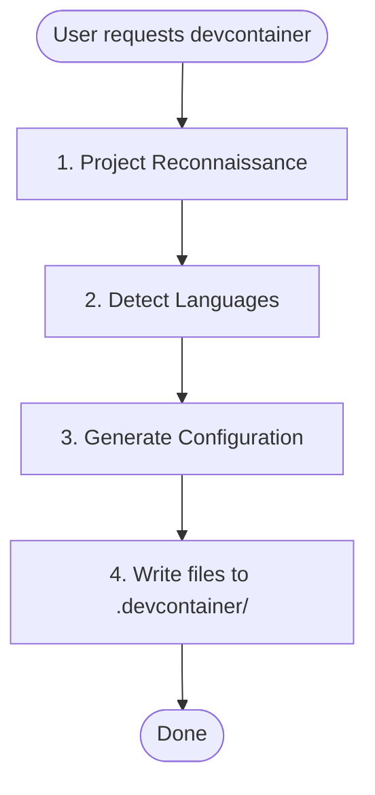

# Devcontainer Setup Skill

## Overview

This public intake copy packages `plugins/antigravity-awesome-skills-claude/skills/devcontainer-setup` from `https://github.com/sickn33/antigravity-awesome-skills` into the native Omni Skills editorial shape without hiding its origin.

Use it when the operator needs the upstream workflow, support files, and repository context to stay intact while the public validator and private enhancer continue their normal downstream flow.

The packaged support pack adds a checklist, rubric, playbook, prompt template, router note, and source manifest so reviewers can audit the import as a complete workflow kit instead of a raw file dump.

# Devcontainer Setup Skill Creates a pre-configured devcontainer with Claude Code and language-specific tooling.

Imported source sections that did not map cleanly to the public headings are still preserved below or in the support files. Notable imported sections: Phase 1: Project Reconnaissance, Phase 2: Generate Configuration, Base Template Features, Language-Specific Sections, Adding Persistent Volumes, Output Files.

## When to Use This Skill

Use this section as the trigger filter. It should make the activation boundary explicit before the operator loads files, runs commands, or opens a pull request.

- User asks to "set up a devcontainer" or "add devcontainer support"
- User wants a sandboxed Claude Code development environment
- User needs isolated development environments with persistent configuration
- User already has a devcontainer configuration and just needs modifications
- User is asking about general Docker or container questions
- User wants to deploy production containers (this is for development only)

## Operating Table

| Situation | Start here | Why it matters |
| --- | --- | --- |
| First-time use | `references/omni-import-playbook.md` | Establishes the workflow, review packet, and provenance expectations before work begins |
| PR review or merge readiness | `references/omni-import-rubric.md` | Turns the imported skill into a checklist-driven review packet instead of an opaque file copy |
| Source or lineage verification | `scripts/omni_import_print_origin.py` | Confirms repository, branch, commit, and imported path quickly |
| Workflow execution | `references/omni-import-checklist.md` | Gives the operator the smallest useful entry point into the support pack |
| Handoff decision | `agents/omni-import-router.md` | Helps the operator switch to a stronger native skill when the task drifts |

## Workflow

This workflow is intentionally editorial and operational at the same time. It keeps the imported source useful to the operator while still satisfying the public intake standards that feed the downstream enhancer flow.

1. ``mermaid flowchart TB start([User requests devcontainer]) recon[1.
2. Project Reconnaissance] detect[2.
3. Detect Languages] generate[3.
4. Generate Configuration] write[4.
5. Write files to .devcontainer/] done([Done]) start --> recon recon --> detect detect --> generate generate --> write write --> done ``
6. Confirm the user goal, the scope of the imported workflow, and whether this skill is still the right router for the task.
7. Read the overview, playbook, and source summary before loading any upstream support files.

### Imported Workflow Notes

#### Imported: Workflow



#### Imported: Phase 1: Project Reconnaissance

### Infer Project Name

Check in order (use first match):

1. `package.json` → `name` field
2. `pyproject.toml` → `project.name`
3. `Cargo.toml` → `package.name`
4. `go.mod` → module path (last segment after `/`)
5. Directory name as fallback

Convert to slug: lowercase, replace spaces/underscores with hyphens.

### Detect Language Stack

| Language | Detection Files |
|----------|-----------------|
| Python | `pyproject.toml`, `*.py` |
| Node/TypeScript | `package.json`, `tsconfig.json` |
| Rust | `Cargo.toml` |
| Go | `go.mod`, `go.sum` |

### Multi-Language Projects

If multiple languages are detected, configure all of them in the following priority order:

1. **Python** - Primary language, uses Dockerfile for uv + Python installation
2. **Node/TypeScript** - Uses devcontainer feature
3. **Rust** - Uses devcontainer feature
4. **Go** - Uses devcontainer feature

For multi-language `postCreateCommand`, chain all setup commands:
```
uv run /opt/post_install.py && uv sync && npm ci
```

Extensions and settings from all detected languages should be merged into the configuration.

## Examples

### Example 1: Ask for the upstream workflow directly

```text
Use @devcontainer-setup to handle <task>. Start with the workflow playbook, load only the upstream files that change the outcome, and keep provenance visible in the answer.
```

**Explanation:** This is the safest starting point when the operator needs the imported workflow, but not the entire repository.

### Example 2: Inspect origin and import state

```bash
python3 skills/devcontainer-setup/scripts/omni_import_print_origin.py
```

**Explanation:** Use this before review or troubleshooting when you need to confirm source repository, branch, commit, and path.

### Example 3: Review the support pack before execution

```bash
python3 skills/devcontainer-setup/scripts/omni_import_list_support_pack.py
```

**Explanation:** This gives the operator a quick inventory of the imported references, examples, scripts, router notes, and manifest files.

### Example 4: Build a reviewer packet

```text
Review @devcontainer-setup using the checklist, rubric, playbook, and source manifest, then summarize any gaps before merge.
```

**Explanation:** This is useful when the PR is waiting for human review and you want a repeatable audit packet.


## Best Practices

Treat the generated public skill as a reviewable packaging layer around the upstream repository. The checklist, rubric, worksheet, template, and playbook are there to make the import auditable, not to hide the source material.

- Keep the imported skill grounded in the upstream repository; do not invent steps that the source material cannot support.
- Prefer the smallest useful set of support files so the workflow stays auditable and fast to review.
- Keep provenance, source commit, and imported file paths visible in notes and PR descriptions.
- Use the checklist, rubric, worksheet, and playbook together instead of relying on a single section in isolation.
- Treat generated examples as scaffolding; adapt them to the concrete task before execution.
- Route to a stronger native skill when architecture, debugging, design, or security concerns become dominant.


## Troubleshooting

### Problem: The operator skipped the imported context and answered too generically

**Symptoms:** The result ignores the upstream workflow in `plugins/antigravity-awesome-skills-claude/skills/devcontainer-setup`, fails to mention provenance, or does not use the support pack at all.
**Solution:** Re-open the checklist, playbook, source summary, and source manifest. Load only the upstream files that materially change the answer, then restate the provenance before continuing.

### Problem: The imported workflow feels incomplete during review

**Symptoms:** Reviewers can see the generated `SKILL.md`, but they cannot quickly tell which references, examples, or scripts matter for the current task.
**Solution:** Use the operator packet and support-pack listing to point at the exact references, examples, scripts, and router notes that justify the path you took. If the gap is still real, record it in the PR instead of hiding it.

### Problem: The task drifted into a different specialization

**Symptoms:** The imported skill starts in the right place, but the work turns into debugging, architecture, design, security, or release orchestration that a native skill handles better.
**Solution:** Use the router note and related skills section to hand off deliberately. Keep the imported provenance visible so the next skill inherits the right context instead of starting blind.


## Related Skills

- `@00-andruia-consultant` - Use when the work is better handled by that native specialization after this imported skill establishes context.
- `@00-andruia-consultant-v2` - Use when the work is better handled by that native specialization after this imported skill establishes context.
- `@10-andruia-skill-smith` - Use when the work is better handled by that native specialization after this imported skill establishes context.
- `@10-andruia-skill-smith-v2` - Use when the work is better handled by that native specialization after this imported skill establishes context.

## Additional Resources

Use this support matrix and the linked files below as the operational packet for this imported skill. Together they provide the checklist, rubric, template, playbook, router guidance, and manifest that the validator expects to see represented in the public skill.

| Resource family | What it gives the reviewer | Example path |
| --- | --- | --- |
| `references` | checklists, rubrics, playbooks, and source summaries | `references/omni-import-checklist.md` |
| `examples` | prompt packets and usage templates | `examples/omni-import-operator-packet.md` |
| `scripts` | origin inspection and support-pack listing | `scripts/omni_import_list_support_pack.py` |
| `agents` | routing and handoff guidance | `agents/omni-import-router.md` |
| `assets` | machine-readable source manifest | `assets/omni-import-source-manifest.json` |

- [Imported intake checklist](references/omni-import-checklist.md)
- [Imported review rubric](references/omni-import-rubric.md)
- [Imported workflow playbook](references/omni-import-playbook.md)
- [Imported source summary](references/omni-import-source-summary.md)
- [Imported operator packet](examples/omni-import-operator-packet.md)
- [Imported prompt template](examples/omni-import-prompt-template.md)
- [Print origin details](scripts/omni_import_print_origin.py)
- [List support pack](scripts/omni_import_list_support_pack.py)

### Imported Reference Notes

#### Imported: Reference Material

For additional guidance, see:
- `references/dockerfile-best-practices.md` - Layer optimization, multi-stage builds, architecture support
- `references/features-vs-dockerfile.md` - When to use devcontainer features vs custom Dockerfile

---

#### Imported: Phase 2: Generate Configuration

Start with base templates from `resources/` directory. Substitute:

- `{{PROJECT_NAME}}` → Human-readable name (e.g., "My Project")
- `{{PROJECT_SLUG}}` → Slug for volumes (e.g., "my-project")

Then apply language-specific modifications below.

#### Imported: Base Template Features

The base template includes:

- **Claude Code** with marketplace plugins (anthropics/skills, trailofbits/skills, trailofbits/skills-curated)
- **Python 3.13** via uv (fast binary download)
- **Node 22** via fnm (Fast Node Manager)
- **ast-grep** for AST-based code search
- **Network isolation tools** (iptables, ipset) with NET_ADMIN capability
- **Modern CLI tools**: ripgrep, fd, fzf, tmux, git-delta

---

#### Imported: Language-Specific Sections

### Python Projects

**Detection:** `pyproject.toml`, `requirements.txt`, `setup.py`, or `*.py` files

**Dockerfile additions:**

The base Dockerfile already includes Python 3.13 via uv. If a different version is required (detected from `pyproject.toml`), modify the Python installation:

```dockerfile
# Install Python via uv (fast binary download, not source compilation)
RUN uv python install <version> --default
```

**devcontainer.json extensions:**

Add to `customizations.vscode.extensions`:
```json
"ms-python.python",
"ms-python.vscode-pylance",
"charliermarsh.ruff"
```

Add to `customizations.vscode.settings`:
```json
"python.defaultInterpreterPath": ".venv/bin/python",
"[python]": {
  "editor.defaultFormatter": "charliermarsh.ruff",
  "editor.codeActionsOnSave": {
    "source.organizeImports": "explicit"
  }
}
```

**postCreateCommand:**
If `pyproject.toml` exists, chain commands:
```
rm -rf .venv && uv sync && uv run /opt/post_install.py
```

---

### Node/TypeScript Projects

**Detection:** `package.json` or `tsconfig.json`

**No Dockerfile additions needed:** The base template includes Node 22 via fnm (Fast Node Manager).

**devcontainer.json extensions:**

Add to `customizations.vscode.extensions`:
```json
"dbaeumer.vscode-eslint",
"esbenp.prettier-vscode"
```

Add to `customizations.vscode.settings`:
```json
"editor.defaultFormatter": "esbenp.prettier-vscode",
"editor.codeActionsOnSave": {
  "source.fixAll.eslint": "explicit"
}
```

**postCreateCommand:**
Detect package manager from lockfile and chain with base command:
- `pnpm-lock.yaml` → `uv run /opt/post_install.py && pnpm install --frozen-lockfile`
- `yarn.lock` → `uv run /opt/post_install.py && yarn install --frozen-lockfile`
- `package-lock.json` → `uv run /opt/post_install.py && npm ci`
- No lockfile → `uv run /opt/post_install.py && npm install`

---

### Rust Projects

**Detection:** `Cargo.toml`

**Features to add:**

```json
"ghcr.io/devcontainers/features/rust:1": {}
```

**devcontainer.json extensions:**

Add to `customizations.vscode.extensions`:
```json
"rust-lang.rust-analyzer",
"tamasfe.even-better-toml"
```

Add to `customizations.vscode.settings`:
```json
"[rust]": {
  "editor.defaultFormatter": "rust-lang.rust-analyzer"
}
```

**postCreateCommand:**
If `Cargo.lock` exists, use locked builds:
```
uv run /opt/post_install.py && cargo build --locked
```
If no lockfile, use standard build:
```
uv run /opt/post_install.py && cargo build
```

---

### Go Projects

**Detection:** `go.mod`

**Features to add:**

```json
"ghcr.io/devcontainers/features/go:1": {
  "version": "latest"
}
```

**devcontainer.json extensions:**

Add to `customizations.vscode.extensions`:
```json
"golang.go"
```

Add to `customizations.vscode.settings`:
```json
"[go]": {
  "editor.defaultFormatter": "golang.go"
},
"go.useLanguageServer": true
```

**postCreateCommand:**
```
uv run /opt/post_install.py && go mod download
```

---

#### Imported: Adding Persistent Volumes

Pattern for new mounts in `devcontainer.json`:

```json
"mounts": [
  "source={{PROJECT_SLUG}}-<purpose>-${devcontainerId},target=<container-path>,type=volume"
]
```

Common additions:
- `source={{PROJECT_SLUG}}-cargo-${devcontainerId},target=/home/vscode/.cargo,type=volume` (Rust)
- `source={{PROJECT_SLUG}}-go-${devcontainerId},target=/home/vscode/go,type=volume` (Go)

---

#### Imported: Output Files

Generate these files in the project's `.devcontainer/` directory:

1. `Dockerfile` - Container build instructions
2. `devcontainer.json` - VS Code/devcontainer configuration
3. `post_install.py` - Post-creation setup script
4. `.zshrc` - Shell configuration
5. `install.sh` - CLI helper for managing the devcontainer (`devc` command)

---

#### Imported: Validation Checklist

Before presenting files to the user, verify:

1. All `{{PROJECT_NAME}}` placeholders are replaced with the human-readable name
2. All `{{PROJECT_SLUG}}` placeholders are replaced with the slugified name
3. JSON syntax is valid in `devcontainer.json` (no trailing commas, proper nesting)
4. Language-specific extensions are added for all detected languages
5. `postCreateCommand` includes all required setup commands (chained with `&&`)

---

#### Imported: User Instructions

After generating, inform the user:

1. How to start: "Open in VS Code and select 'Reopen in Container'"
2. Alternative: `devcontainer up --workspace-folder .`
3. CLI helper: Run `.devcontainer/install.sh self-install` to add the `devc` command to PATH

#### Imported: Limitations

- Use this skill only when the task clearly matches the scope described above.
- Do not treat the output as a substitute for environment-specific validation, testing, or expert review.
- Stop and ask for clarification if required inputs, permissions, safety boundaries, or success criteria are missing.
