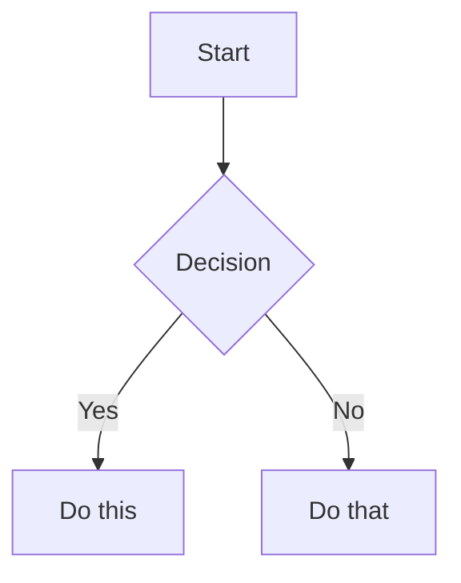

# Obsidian Flavored Markdown Skill

## Overview

This public intake copy packages `plugins/antigravity-awesome-skills-claude/skills/obsidian-markdown` from `https://github.com/sickn33/antigravity-awesome-skills` into the native Omni Skills editorial shape without hiding its origin.

Use it when the operator needs the upstream workflow, support files, and repository context to stay intact while the public validator and private enhancer continue their normal downstream flow.

This intake keeps the copied upstream files intact and uses `metadata.json` plus `ORIGIN.md` as the provenance anchor for review.

# Obsidian Flavored Markdown Skill Create and edit valid Obsidian Flavored Markdown. Obsidian extends CommonMark and GFM with wikilinks, embeds, callouts, properties, comments, and other syntax. This skill covers only Obsidian-specific extensions -- standard Markdown (headings, bold, italic, lists, quotes, code blocks, tables) is assumed knowledge.

Imported source sections that did not map cleanly to the public headings are still preserved below or in the support files. Notable imported sections: Internal Links (Wikilinks), Embeds, Callouts, Properties (Frontmatter), Tags, Comments.

## When to Use This Skill

Use this section as the trigger filter. It should make the activation boundary explicit before the operator loads files, runs commands, or opens a pull request.

- Use when writing or editing Markdown notes intended for Obsidian.
- Use when the task involves wikilinks, embeds, callouts, frontmatter properties, or Obsidian-specific syntax.
- Use when the user wants notes that render correctly inside an Obsidian vault.
- Use when the request clearly matches the imported source intent: Create and edit Obsidian Flavored Markdown with wikilinks, embeds, callouts, properties, and other Obsidian-specific syntax. Use when working with .md files in Obsidian, or when the user mentions wikilinks, callouts,....
- Use when the operator should preserve upstream workflow detail instead of rewriting the process from scratch.
- Use when provenance needs to stay visible in the answer, PR, or review packet.

## Operating Table

| Situation | Start here | Why it matters |
| --- | --- | --- |
| First-time use | `metadata.json` | Confirms repository, branch, commit, and imported path before touching the copied workflow |
| Provenance review | `ORIGIN.md` | Gives reviewers a plain-language audit trail for the imported source |
| Workflow execution | `references/CALLOUTS.md` | Starts with the smallest copied file that materially changes execution |
| Supporting context | `references/EMBEDS.md` | Adds the next most relevant copied source file without loading the entire package |
| Handoff decision | `## Related Skills` | Helps the operator switch to a stronger native skill when the task drifts |

## Workflow

This workflow is intentionally editorial and operational at the same time. It keeps the imported source useful to the operator while still satisfying the public intake standards that feed the downstream enhancer flow.

1. Add frontmatter with properties (title, tags, aliases) at the top of the file. See PROPERTIES.md for all property types.
2. Write content using standard Markdown for structure, plus Obsidian-specific syntax below.
3. Link related notes using wikilinks ([[Note]]) for internal vault connections, or standard Markdown links for external URLs.
4. Embed content from other notes, images, or PDFs using the ![[embed]] syntax. See EMBEDS.md for all embed types.
5. Add callouts for highlighted information using > [!type] syntax. See CALLOUTS.md for all callout types.
6. Verify the note renders correctly in Obsidian's reading view.
7. Confirm the user goal, the scope of the imported workflow, and whether this skill is still the right router for the task.

### Imported Workflow Notes

#### Imported: Workflow: Creating an Obsidian Note

1. **Add frontmatter** with properties (title, tags, aliases) at the top of the file. See [PROPERTIES.md](references/PROPERTIES.md) for all property types.
2. **Write content** using standard Markdown for structure, plus Obsidian-specific syntax below.
3. **Link related notes** using wikilinks (`[[Note]]`) for internal vault connections, or standard Markdown links for external URLs.
4. **Embed content** from other notes, images, or PDFs using the `![[embed]]` syntax. See [EMBEDS.md](references/EMBEDS.md) for all embed types.
5. **Add callouts** for highlighted information using `> [!type]` syntax. See [CALLOUTS.md](references/CALLOUTS.md) for all callout types.
6. **Verify** the note renders correctly in Obsidian's reading view.

> When choosing between wikilinks and Markdown links: use `[[wikilinks]]` for notes within the vault (Obsidian tracks renames automatically) and plain Markdown links for external URLs only.

#### Imported: Internal Links (Wikilinks)

```markdown
[[Note Name]]                          Link to note
[[Note Name|Display Text]]             Custom display text
[[Note Name#Heading]]                  Link to heading
[[Note Name#^block-id]]                Link to block
[[#Heading in same note]]              Same-note heading link
```

Define a block ID by appending `^block-id` to any paragraph:

```markdown
This paragraph can be linked to. ^my-block-id
```

For lists and quotes, place the block ID on a separate line after the block:

```markdown
> A quote block

^quote-id
```

## Examples

### Example 1: Ask for the upstream workflow directly

```text
Use @obsidian-markdown to handle <task>. Start from the copied upstream workflow, load only the files that change the outcome, and keep provenance visible in the answer.
```

**Explanation:** This is the safest starting point when the operator needs the imported workflow, but not the entire repository.

### Example 2: Ask for a provenance-grounded review

```text
Review @obsidian-markdown against metadata.json and ORIGIN.md, then explain which copied upstream files you would load first and why.
```

**Explanation:** Use this before review or troubleshooting when you need a precise, auditable explanation of origin and file selection.

### Example 3: Narrow the copied support files before execution

```text
Use @obsidian-markdown for <task>. Load only the copied references, examples, or scripts that change the outcome, and name the files explicitly before proceeding.
```

**Explanation:** This keeps the skill aligned with progressive disclosure instead of loading the whole copied package by default.

### Example 4: Build a reviewer packet

```text
Review @obsidian-markdown using the copied upstream files plus provenance, then summarize any gaps before merge.
```

**Explanation:** This is useful when the PR is waiting for human review and you want a repeatable audit packet.

### Imported Usage Notes

#### Imported: Complete Example

````markdown
---
title: Project Alpha
date: 2024-01-15
tags:
  - project
  - active
status: in-progress
---

# Project Alpha

This project aims to [[improve workflow]] using modern techniques.

> [!important] Key Deadline
> The first milestone is due on ==January 30th==.

## Best Practices

Treat the generated public skill as a reviewable packaging layer around the upstream repository. The goal is to keep provenance explicit and load only the copied source material that materially improves execution.

- Keep the imported skill grounded in the upstream repository; do not invent steps that the source material cannot support.
- Prefer the smallest useful set of support files so the workflow stays auditable and fast to review.
- Keep provenance, source commit, and imported file paths visible in notes and PR descriptions.
- Point directly at the copied upstream files that justify the workflow instead of relying on generic review boilerplate.
- Treat generated examples as scaffolding; adapt them to the concrete task before execution.
- Route to a stronger native skill when architecture, debugging, design, or security concerns become dominant.


## Troubleshooting

### Problem: The operator skipped the imported context and answered too generically

**Symptoms:** The result ignores the upstream workflow in `plugins/antigravity-awesome-skills-claude/skills/obsidian-markdown`, fails to mention provenance, or does not use any copied source files at all.
**Solution:** Re-open `metadata.json`, `ORIGIN.md`, and the most relevant copied upstream files. Load only the files that materially change the answer, then restate the provenance before continuing.

### Problem: The imported workflow feels incomplete during review

**Symptoms:** Reviewers can see the generated `SKILL.md`, but they cannot quickly tell which references, examples, or scripts matter for the current task.
**Solution:** Point at the exact copied references, examples, scripts, or assets that justify the path you took. If the gap is still real, record it in the PR instead of hiding it.

### Problem: The task drifted into a different specialization

**Symptoms:** The imported skill starts in the right place, but the work turns into debugging, architecture, design, security, or release orchestration that a native skill handles better.
**Solution:** Use the related skills section to hand off deliberately. Keep the imported provenance visible so the next skill inherits the right context instead of starting blind.


## Related Skills

- `@monte-carlo-monitor-creation` - Use when the work is better handled by that native specialization after this imported skill establishes context.
- `@monte-carlo-prevent` - Use when the work is better handled by that native specialization after this imported skill establishes context.
- `@monte-carlo-push-ingestion` - Use when the work is better handled by that native specialization after this imported skill establishes context.
- `@monte-carlo-validation-notebook` - Use when the work is better handled by that native specialization after this imported skill establishes context.

## Additional Resources

Use this support matrix and the linked files below as the operator packet for this imported skill. They should reflect real copied source material, not generic scaffolding.

| Resource family | What it gives the reviewer | Example path |
| --- | --- | --- |
| `references` | copied reference notes, guides, or background material from upstream | `references/CALLOUTS.md` |
| `examples` | worked examples or reusable prompts copied from upstream | `examples/n/a` |
| `scripts` | upstream helper scripts that change execution or validation | `scripts/n/a` |
| `agents` | routing or delegation notes that are genuinely part of the imported package | `agents/n/a` |
| `assets` | supporting assets or schemas copied from the source package | `assets/n/a` |

- [CALLOUTS.md](references/CALLOUTS.md)
- [EMBEDS.md](references/EMBEDS.md)
- [PROPERTIES.md](references/PROPERTIES.md)
- [CALLOUTS.md](references/CALLOUTS.md)
- [EMBEDS.md](references/EMBEDS.md)
- [PROPERTIES.md](references/PROPERTIES.md)

### Imported Reference Notes

#### Imported: References

- [Obsidian Flavored Markdown](https://help.obsidian.md/obsidian-flavored-markdown)
- [Internal links](https://help.obsidian.md/links)
- [Embed files](https://help.obsidian.md/embeds)
- [Callouts](https://help.obsidian.md/callouts)
- [Properties](https://help.obsidian.md/properties)

#### Imported: Embeds

Prefix any wikilink with `!` to embed its content inline:

```markdown
![[Note Name]]                         Embed full note
![[Note Name#Heading]]                 Embed section
![[image.png]]                         Embed image
![[image.png|300]]                     Embed image with width
![[document.pdf#page=3]]               Embed PDF page
```

See [EMBEDS.md](references/EMBEDS.md) for audio, video, search embeds, and external images.

#### Imported: Callouts

```markdown
> [!note]
> Basic callout.

> [!warning] Custom Title
> Callout with a custom title.

> [!faq]- Collapsed by default
> Foldable callout (- collapsed, + expanded).
```

Common types: `note`, `tip`, `warning`, `info`, `example`, `quote`, `bug`, `danger`, `success`, `failure`, `question`, `abstract`, `todo`.

See [CALLOUTS.md](references/CALLOUTS.md) for the full list with aliases, nesting, and custom CSS callouts.

#### Imported: Properties (Frontmatter)

```yaml
---
title: My Note
date: 2024-01-15
tags:
  - project
  - active
aliases:
  - Alternative Name
cssclasses:
  - custom-class
---
```

Default properties: `tags` (searchable labels), `aliases` (alternative note names for link suggestions), `cssclasses` (CSS classes for styling).

See [PROPERTIES.md](references/PROPERTIES.md) for all property types, tag syntax rules, and advanced usage.

#### Imported: Tags

```markdown
#tag                    Inline tag
#nested/tag             Nested tag with hierarchy
```

Tags can contain letters, numbers (not first character), underscores, hyphens, and forward slashes. Tags can also be defined in frontmatter under the `tags` property.

#### Imported: Comments

```markdown
This is visible %%but this is hidden%% text.

%%
This entire block is hidden in reading view.
%%
```

#### Imported: Obsidian-Specific Formatting

```markdown
==Highlighted text==                   Highlight syntax
```

#### Imported: Math (LaTeX)

```markdown
Inline: $e^{i\pi} + 1 = 0$

Block:
$$
\frac{a}{b} = c
$$
```

#### Imported: Diagrams (Mermaid)

````markdown

````

To link Mermaid nodes to Obsidian notes, add `class NodeName internal-link;`.

#### Imported: Footnotes

```markdown
Text with a footnote[^1].

[^1]: Footnote content.

Inline footnote.^[This is inline.]
```

#### Imported: Tasks

- [x] Initial planning
- [ ] Development phase
  - [ ] Backend implementation
  - [ ] Frontend design

#### Imported: Notes

The algorithm uses $O(n \log n)$ sorting. See [[Algorithm Notes#Sorting]] for details.

![[Architecture Diagram.png|600]]

Reviewed in [[Meeting Notes 2024-01-10#Decisions]].
````

#### Imported: Limitations

- Use this skill only when the task clearly matches the scope described above.
- Do not treat the output as a substitute for environment-specific validation, testing, or expert review.
- Stop and ask for clarification if required inputs, permissions, safety boundaries, or success criteria are missing.
