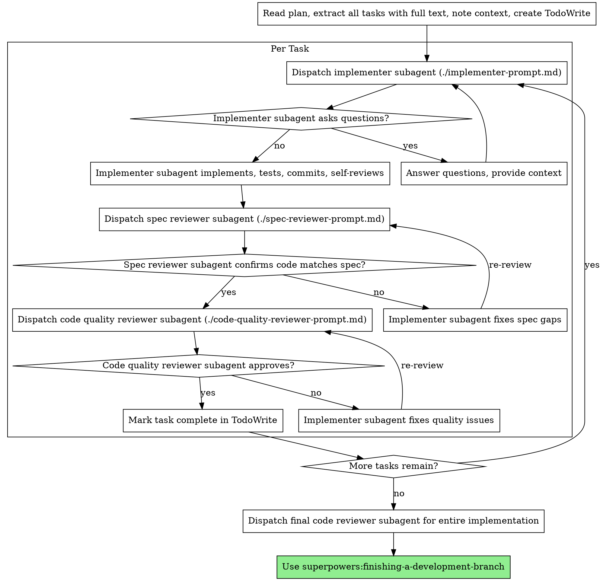

# Subagent-Driven Development

## Overview

This public intake copy packages `plugins/antigravity-awesome-skills-claude/skills/subagent-driven-development` from `https://github.com/sickn33/antigravity-awesome-skills` into the native Omni Skills editorial shape without hiding its origin.

Use it when the operator needs the upstream workflow, support files, and repository context to stay intact while the public validator and private enhancer continue their normal downstream flow.

This intake keeps the copied upstream files intact and uses `EXTERNAL_SOURCE.json` plus `ORIGIN.md` as the provenance anchor for review.

# Subagent-Driven Development Execute plan by dispatching fresh subagent per task, with two-stage review after each: spec compliance review first, then code quality review. Core principle: Fresh subagent per task + two-stage review (spec then quality) = high quality, fast iteration

Imported source sections that did not map cleanly to the public headings are still preserved below or in the support files. Notable imported sections: Prompt Templates, Advantages, Red Flags, Integration, Limitations.

## When to Use This Skill

Use this section as the trigger filter. It should make the activation boundary explicit before the operator loads files, runs commands, or opens a pull request.

- Same session (no context switch)
- Fresh subagent per task (no context pollution)
- Two-stage review after each task: spec compliance first, then code quality
- Faster iteration (no human-in-loop between tasks)
- Use when the request clearly matches the imported source intent: executing implementation plans with independent tasks in the current session.
- Use when the operator should preserve upstream workflow detail instead of rewriting the process from scratch.

## Operating Table

| Situation | Start here | Why it matters |
| --- | --- | --- |
| First-time use | `EXTERNAL_SOURCE.json` | Confirms repository, branch, commit, and imported path before touching the copied workflow |
| Provenance review | `ORIGIN.md` | Gives reviewers a plain-language audit trail for the imported source |
| Workflow execution | `code-quality-reviewer-prompt.md` | Starts with the smallest copied file that materially changes execution |
| Supporting context | `implementer-prompt.md` | Adds the next most relevant copied source file without loading the entire package |
| Handoff decision | `## Related Skills` | Helps the operator switch to a stronger native skill when the task drifts |

## Workflow

This workflow is intentionally editorial and operational at the same time. It keeps the imported source useful to the operator while still satisfying the public intake standards that feed the downstream enhancer flow.

1. Implemented install-hook command
2. Added tests, 5/5 passing
3. Self-review: Found I missed --force flag, added it
4. Committed
5. Added verify/repair modes
6. 8/8 tests passing
7. Self-review: All good

### Imported Workflow Notes

#### Imported: The Process



#### Imported: Example Workflow

```
You: I'm using Subagent-Driven Development to execute this plan.

[Read plan file once: docs/plans/feature-plan.md]
[Extract all 5 tasks with full text and context]
[Create TodoWrite with all tasks]

Task 1: Hook installation script

[Get Task 1 text and context (already extracted)]
[Dispatch implementation subagent with full task text + context]

Implementer: "Before I begin - should the hook be installed at user or system level?"

You: "User level (~/.config/superpowers/hooks/)"

Implementer: "Got it. Implementing now..."
[Later] Implementer:
  - Implemented install-hook command
  - Added tests, 5/5 passing
  - Self-review: Found I missed --force flag, added it
  - Committed

[Dispatch spec compliance reviewer]
Spec reviewer: ✅ Spec compliant - all requirements met, nothing extra

[Get git SHAs, dispatch code quality reviewer]
Code reviewer: Strengths: Good test coverage, clean. Issues: None. Approved.

[Mark Task 1 complete]

Task 2: Recovery modes

[Get Task 2 text and context (already extracted)]
[Dispatch implementation subagent with full task text + context]

Implementer: [No questions, proceeds]
Implementer:
  - Added verify/repair modes
  - 8/8 tests passing
  - Self-review: All good
  - Committed

[Dispatch spec compliance reviewer]
Spec reviewer: ❌ Issues:
  - Missing: Progress reporting (spec says "report every 100 items")
  - Extra: Added --json flag (not requested)

[Implementer fixes issues]
Implementer: Removed --json flag, added progress reporting

[Spec reviewer reviews again]
Spec reviewer: ✅ Spec compliant now

[Dispatch code quality reviewer]
Code reviewer: Strengths: Solid. Issues (Important): Magic number (100)

[Implementer fixes]
Implementer: Extracted PROGRESS_INTERVAL constant

[Code reviewer reviews again]
Code reviewer: ✅ Approved

[Mark Task 2 complete]

...

[After all tasks]
[Dispatch final code-reviewer]
Final reviewer: All requirements met, ready to merge

Done!
```

#### Imported: Prompt Templates

- `./implementer-prompt.md` - Dispatch implementer subagent
- `./spec-reviewer-prompt.md` - Dispatch spec compliance reviewer subagent
- `./code-quality-reviewer-prompt.md` - Dispatch code quality reviewer subagent

## Examples

### Example 1: Ask for the upstream workflow directly

```text
Use @subagent-driven-development to handle <task>. Start from the copied upstream workflow, load only the files that change the outcome, and keep provenance visible in the answer.
```

**Explanation:** This is the safest starting point when the operator needs the imported workflow, but not the entire repository.

### Example 2: Ask for a provenance-grounded review

```text
Review @subagent-driven-development against EXTERNAL_SOURCE.json and ORIGIN.md, then explain which copied upstream files you would load first and why.
```

**Explanation:** Use this before review or troubleshooting when you need a precise, auditable explanation of origin and file selection.

### Example 3: Narrow the copied support files before execution

```text
Use @subagent-driven-development for <task>. Load only the copied references, examples, or scripts that change the outcome, and name the files explicitly before proceeding.
```

**Explanation:** This keeps the skill aligned with progressive disclosure instead of loading the whole copied package by default.

### Example 4: Build a reviewer packet

```text
Review @subagent-driven-development using the copied upstream files plus provenance, then summarize any gaps before merge.
```

**Explanation:** This is useful when the PR is waiting for human review and you want a repeatable audit packet.


## Best Practices

Treat the generated public skill as a reviewable packaging layer around the upstream repository. The goal is to keep provenance explicit and load only the copied source material that materially improves execution.

- Keep the imported skill grounded in the upstream repository; do not invent steps that the source material cannot support.
- Prefer the smallest useful set of support files so the workflow stays auditable and fast to review.
- Keep provenance, source commit, and imported file paths visible in notes and PR descriptions.
- Point directly at the copied upstream files that justify the workflow instead of relying on generic review boilerplate.
- Treat generated examples as scaffolding; adapt them to the concrete task before execution.
- Route to a stronger native skill when architecture, debugging, design, or security concerns become dominant.


## Troubleshooting

### Problem: The operator skipped the imported context and answered too generically

**Symptoms:** The result ignores the upstream workflow in `plugins/antigravity-awesome-skills-claude/skills/subagent-driven-development`, fails to mention provenance, or does not use any copied source files at all.
**Solution:** Re-open `EXTERNAL_SOURCE.json`, `ORIGIN.md`, and the most relevant copied upstream files. Load only the files that materially change the answer, then restate the provenance before continuing.

### Problem: The imported workflow feels incomplete during review

**Symptoms:** Reviewers can see the generated `SKILL.md`, but they cannot quickly tell which references, examples, or scripts matter for the current task.
**Solution:** Point at the exact copied references, examples, scripts, or assets that justify the path you took. If the gap is still real, record it in the PR instead of hiding it.

### Problem: The task drifted into a different specialization

**Symptoms:** The imported skill starts in the right place, but the work turns into debugging, architecture, design, security, or release orchestration that a native skill handles better.
**Solution:** Use the related skills section to hand off deliberately. Keep the imported provenance visible so the next skill inherits the right context instead of starting blind.


## Related Skills

- `@server-management` - Use when the work is better handled by that native specialization after this imported skill establishes context.
- `@service-mesh-expert` - Use when the work is better handled by that native specialization after this imported skill establishes context.
- `@service-mesh-observability` - Use when the work is better handled by that native specialization after this imported skill establishes context.
- `@sexual-health-analyzer` - Use when the work is better handled by that native specialization after this imported skill establishes context.

## Additional Resources

Use this support matrix and the linked files below as the operator packet for this imported skill. They should reflect real copied source material, not generic scaffolding.

| Resource family | What it gives the reviewer | Example path |
| --- | --- | --- |
| `references` | copied reference notes, guides, or background material from upstream | `references/n/a` |
| `examples` | worked examples or reusable prompts copied from upstream | `examples/n/a` |
| `scripts` | upstream helper scripts that change execution or validation | `scripts/n/a` |
| `agents` | routing or delegation notes that are genuinely part of the imported package | `agents/n/a` |
| `assets` | supporting assets or schemas copied from the source package | `assets/n/a` |

- [code-quality-reviewer-prompt.md](code-quality-reviewer-prompt.md)
- [implementer-prompt.md](implementer-prompt.md)
- [spec-reviewer-prompt.md](spec-reviewer-prompt.md)

### Imported Reference Notes

#### Imported: Advantages

**vs. Manual execution:**
- Subagents follow TDD naturally
- Fresh context per task (no confusion)
- Parallel-safe (subagents don't interfere)
- Subagent can ask questions (before AND during work)

**vs. Executing Plans:**
- Same session (no handoff)
- Continuous progress (no waiting)
- Review checkpoints automatic

**Efficiency gains:**
- No file reading overhead (controller provides full text)
- Controller curates exactly what context is needed
- Subagent gets complete information upfront
- Questions surfaced before work begins (not after)

**Quality gates:**
- Self-review catches issues before handoff
- Two-stage review: spec compliance, then code quality
- Review loops ensure fixes actually work
- Spec compliance prevents over/under-building
- Code quality ensures implementation is well-built

**Cost:**
- More subagent invocations (implementer + 2 reviewers per task)
- Controller does more prep work (extracting all tasks upfront)
- Review loops add iterations
- But catches issues early (cheaper than debugging later)

#### Imported: Red Flags

**Never:**
- Skip reviews (spec compliance OR code quality)
- Proceed with unfixed issues
- Dispatch multiple implementation subagents in parallel (conflicts)
- Make subagent read plan file (provide full text instead)
- Skip scene-setting context (subagent needs to understand where task fits)
- Ignore subagent questions (answer before letting them proceed)
- Accept "close enough" on spec compliance (spec reviewer found issues = not done)
- Skip review loops (reviewer found issues = implementer fixes = review again)
- Let implementer self-review replace actual review (both are needed)
- **Start code quality review before spec compliance is ✅** (wrong order)
- Move to next task while either review has open issues

**If subagent asks questions:**
- Answer clearly and completely
- Provide additional context if needed
- Don't rush them into implementation

**If reviewer finds issues:**
- Implementer (same subagent) fixes them
- Reviewer reviews again
- Repeat until approved
- Don't skip the re-review

**If subagent fails task:**
- Dispatch fix subagent with specific instructions
- Don't try to fix manually (context pollution)

#### Imported: Integration

**Required workflow skills:**
- **superpowers:writing-plans** - Creates the plan this skill executes
- **superpowers:requesting-code-review** - Code review template for reviewer subagents
- **superpowers:finishing-a-development-branch** - Complete development after all tasks

**Subagents should use:**
- **superpowers:test-driven-development** - Subagents follow TDD for each task

**Alternative workflow:**
- **superpowers:executing-plans** - Use for parallel session instead of same-session execution

#### Imported: Limitations

- Use this skill only when the task clearly matches the scope described above.
- Do not treat the output as a substitute for environment-specific validation, testing, or expert review.
- Stop and ask for clarification if required inputs, permissions, safety boundaries, or success criteria are missing.
