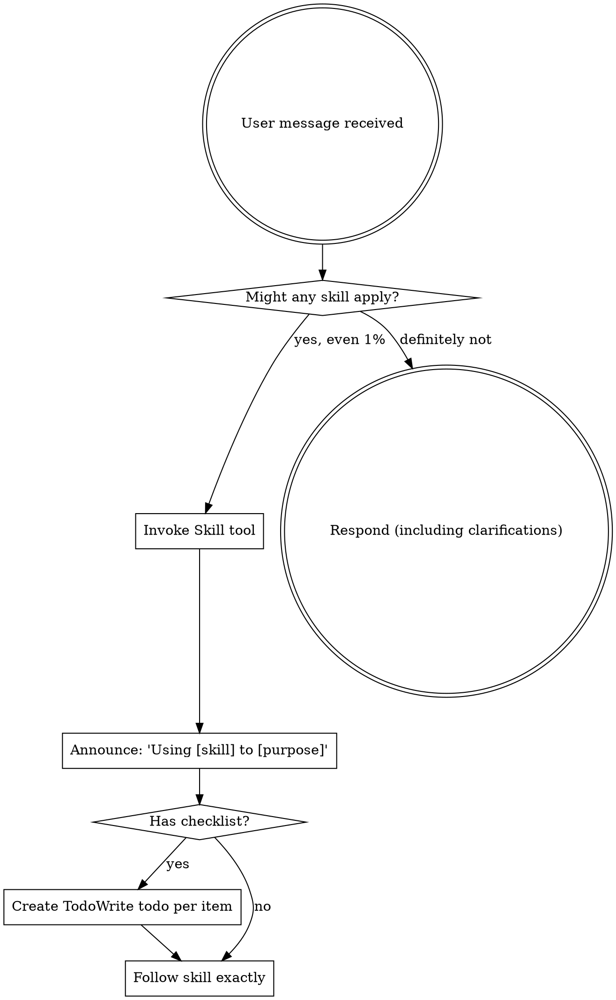

# Using Skills

## Overview

This public intake copy packages `plugins/antigravity-awesome-skills-claude/skills/using-superpowers` from `https://github.com/sickn33/antigravity-awesome-skills` into the native Omni Skills editorial shape without hiding its origin.

Use it when the operator needs the upstream workflow, support files, and repository context to stay intact while the public validator and private enhancer continue their normal downstream flow.

The packaged support pack adds a checklist, rubric, playbook, prompt template, router note, and source manifest so reviewers can audit the import as a complete workflow kit instead of a raw file dump.

<EXTREMELY-IMPORTANT> If you think there is even a 1% chance a skill might apply to what you are doing, you ABSOLUTELY MUST invoke the skill. IF A SKILL APPLIES TO YOUR TASK, YOU DO NOT HAVE A CHOICE. YOU MUST USE IT. This is not negotiable. This is not optional. You cannot rationalize your way out of this. </EXTREMELY-IMPORTANT>

Imported source sections that did not map cleanly to the public headings are still preserved below or in the support files. Notable imported sections: How to Access Skills, Red Flags, Skill Priority, Skill Types, User Instructions, Limitations.

## When to Use This Skill

Use this section as the trigger filter. It should make the activation boundary explicit before the operator loads files, runs commands, or opens a pull request.

- This skill is applicable to execute the workflow or actions described in the overview.
- Use when the request clearly matches the imported source intent: starting any conversation - establishes how to find and use skills, requiring Skill tool invocation before ANY response including clarifying questions.
- Use when the operator should preserve upstream workflow detail instead of rewriting the process from scratch.
- Use when provenance needs to stay visible in the answer, PR, or review packet.
- Use when the support pack, checklist, rubric, and playbook should guide execution before touching code or tools.
- Use when the workflow should remain reviewable in the public intake repo before the private enhancer takes over.

## Operating Table

| Situation | Start here | Why it matters |
| --- | --- | --- |
| First-time use | `references/omni-import-playbook.md` | Establishes the workflow, review packet, and provenance expectations before work begins |
| PR review or merge readiness | `references/omni-import-rubric.md` | Turns the imported skill into a checklist-driven review packet instead of an opaque file copy |
| Source or lineage verification | `scripts/omni_import_print_origin.py` | Confirms repository, branch, commit, and imported path quickly |
| Workflow execution | `references/omni-import-checklist.md` | Gives the operator the smallest useful entry point into the support pack |
| Handoff decision | `agents/omni-import-router.md` | Helps the operator switch to a stronger native skill when the task drifts |

## Workflow

This workflow is intentionally editorial and operational at the same time. It keeps the imported source useful to the operator while still satisfying the public intake standards that feed the downstream enhancer flow.

1. Confirm the user goal, the scope of the imported workflow, and whether this skill is still the right router for the task.
2. Read the overview, playbook, and source summary before loading any upstream support files.
3. Load only the references, examples, prompts, or scripts that materially change the outcome for the current request.
4. Execute the upstream workflow while keeping provenance and source boundaries explicit in the working notes.
5. Validate the result against the checklist, rubric, and expected evidence for the task.
6. Escalate or hand off to a related skill when the work moves out of this imported workflow's center of gravity.
7. Before merge or closure, record what was used, what changed, and what the reviewer still needs to verify.

### Imported Workflow Notes

#### Imported: How to Access Skills

**In Claude Code:** Use the `Skill` tool. When you invoke a skill, its content is loaded and presented to you—follow it directly. Never use the Read tool on skill files.

**In other environments:** Check your platform's documentation for how skills are loaded.

# Using Skills

## Examples

### Example 1: Ask for the upstream workflow directly

```text
Use @using-superpowers to handle <task>. Start with the workflow playbook, load only the upstream files that change the outcome, and keep provenance visible in the answer.
```

**Explanation:** This is the safest starting point when the operator needs the imported workflow, but not the entire repository.

### Example 2: Inspect origin and import state

```bash
python3 skills/using-superpowers/scripts/omni_import_print_origin.py
```

**Explanation:** Use this before review or troubleshooting when you need to confirm source repository, branch, commit, and path.

### Example 3: Review the support pack before execution

```bash
python3 skills/using-superpowers/scripts/omni_import_list_support_pack.py
```

**Explanation:** This gives the operator a quick inventory of the imported references, examples, scripts, router notes, and manifest files.

### Example 4: Build a reviewer packet

```text
Review @using-superpowers using the checklist, rubric, playbook, and source manifest, then summarize any gaps before merge.
```

**Explanation:** This is useful when the PR is waiting for human review and you want a repeatable audit packet.


## Best Practices

Treat the generated public skill as a reviewable packaging layer around the upstream repository. The checklist, rubric, worksheet, template, and playbook are there to make the import auditable, not to hide the source material.

- Invoke relevant or requested skills BEFORE any response or action.
- Even a 1% chance a skill might apply means that you should invoke the skill to check.
- If an invoked skill turns out to be wrong for the situation, you don't need to use it.
- dot digraph skill_flow { "User message received" [shape=doublecircle]; "Might any skill apply?" [shape=diamond]; "Invoke Skill tool" [shape=box]; "Announce: 'Using [skill] to [purpose]'" [shape=box]; "Has checklist?" [shape=diamond]; "Create TodoWrite todo per item" [shape=box]; "Follow skill exactly" [shape=box]; "Respond (including clarifications)" [shape=doublecircle]; "User message received" -> "Might any skill apply?"; "Might any skill apply?" -> "Invoke Skill tool" [label="yes, even 1%"]; "Might any skill apply?" -> "Respond (including clarifications)" [label="definitely not"]; "Invoke Skill tool" -> "Announce: 'Using [skill] to [purpose]'"; "Announce: 'Using [skill] to [purpose]'" -> "Has checklist?"; "Has checklist?" -> "Create TodoWrite todo per item" [label="yes"]; "Has checklist?" -> "Follow skill exactly" [label="no"]; "Create TodoWrite todo per item" -> "Follow skill exactly"; }
- Keep the imported skill grounded in the upstream repository; do not invent steps that the source material cannot support.
- Prefer the smallest useful set of support files so the workflow stays auditable and fast to review.
- Keep provenance, source commit, and imported file paths visible in notes and PR descriptions.

### Imported Operating Notes

#### Imported: The Rule

**Invoke relevant or requested skills BEFORE any response or action.** Even a 1% chance a skill might apply means that you should invoke the skill to check. If an invoked skill turns out to be wrong for the situation, you don't need to use it.



## Troubleshooting

### Problem: The operator skipped the imported context and answered too generically

**Symptoms:** The result ignores the upstream workflow in `plugins/antigravity-awesome-skills-claude/skills/using-superpowers`, fails to mention provenance, or does not use the support pack at all.
**Solution:** Re-open the checklist, playbook, source summary, and source manifest. Load only the upstream files that materially change the answer, then restate the provenance before continuing.

### Problem: The imported workflow feels incomplete during review

**Symptoms:** Reviewers can see the generated `SKILL.md`, but they cannot quickly tell which references, examples, or scripts matter for the current task.
**Solution:** Use the operator packet and support-pack listing to point at the exact references, examples, scripts, and router notes that justify the path you took. If the gap is still real, record it in the PR instead of hiding it.

### Problem: The task drifted into a different specialization

**Symptoms:** The imported skill starts in the right place, but the work turns into debugging, architecture, design, security, or release orchestration that a native skill handles better.
**Solution:** Use the router note and related skills section to hand off deliberately. Keep the imported provenance visible so the next skill inherits the right context instead of starting blind.


## Related Skills

- `@00-andruia-consultant` - Use when the work is better handled by that native specialization after this imported skill establishes context.
- `@00-andruia-consultant-v2` - Use when the work is better handled by that native specialization after this imported skill establishes context.
- `@10-andruia-skill-smith` - Use when the work is better handled by that native specialization after this imported skill establishes context.
- `@10-andruia-skill-smith-v2` - Use when the work is better handled by that native specialization after this imported skill establishes context.

## Additional Resources

Use this support matrix and the linked files below as the operational packet for this imported skill. Together they provide the checklist, rubric, template, playbook, router guidance, and manifest that the validator expects to see represented in the public skill.

| Resource family | What it gives the reviewer | Example path |
| --- | --- | --- |
| `references` | checklists, rubrics, playbooks, and source summaries | `references/omni-import-checklist.md` |
| `examples` | prompt packets and usage templates | `examples/omni-import-operator-packet.md` |
| `scripts` | origin inspection and support-pack listing | `scripts/omni_import_list_support_pack.py` |
| `agents` | routing and handoff guidance | `agents/omni-import-router.md` |
| `assets` | machine-readable source manifest | `assets/omni-import-source-manifest.json` |

- [Imported intake checklist](references/omni-import-checklist.md)
- [Imported review rubric](references/omni-import-rubric.md)
- [Imported workflow playbook](references/omni-import-playbook.md)
- [Imported source summary](references/omni-import-source-summary.md)
- [Imported operator packet](examples/omni-import-operator-packet.md)
- [Imported prompt template](examples/omni-import-prompt-template.md)
- [Print origin details](scripts/omni_import_print_origin.py)
- [List support pack](scripts/omni_import_list_support_pack.py)

### Imported Reference Notes

#### Imported: Red Flags

These thoughts mean STOP—you're rationalizing:

| Thought | Reality |
|---------|---------|
| "This is just a simple question" | Questions are tasks. Check for skills. |
| "I need more context first" | Skill check comes BEFORE clarifying questions. |
| "Let me explore the codebase first" | Skills tell you HOW to explore. Check first. |
| "I can check git/files quickly" | Files lack conversation context. Check for skills. |
| "Let me gather information first" | Skills tell you HOW to gather information. |
| "This doesn't need a formal skill" | If a skill exists, use it. |
| "I remember this skill" | Skills evolve. Read current version. |
| "This doesn't count as a task" | Action = task. Check for skills. |
| "The skill is overkill" | Simple things become complex. Use it. |
| "I'll just do this one thing first" | Check BEFORE doing anything. |
| "This feels productive" | Undisciplined action wastes time. Skills prevent this. |
| "I know what that means" | Knowing the concept ≠ using the skill. Invoke it. |

#### Imported: Skill Priority

When multiple skills could apply, use this order:

1. **Process skills first** (brainstorming, debugging) - these determine HOW to approach the task
2. **Implementation skills second** (frontend-design, mcp-builder) - these guide execution

"Let's build X" → brainstorming first, then implementation skills.
"Fix this bug" → debugging first, then domain-specific skills.

#### Imported: Skill Types

**Rigid** (TDD, debugging): Follow exactly. Don't adapt away discipline.

**Flexible** (patterns): Adapt principles to context.

The skill itself tells you which.

#### Imported: User Instructions

Instructions say WHAT, not HOW. "Add X" or "Fix Y" doesn't mean skip workflows.

#### Imported: Limitations

- Use this skill only when the task clearly matches the scope described above.
- Do not treat the output as a substitute for environment-specific validation, testing, or expert review.
- Stop and ask for clarification if required inputs, permissions, safety boundaries, or success criteria are missing.
